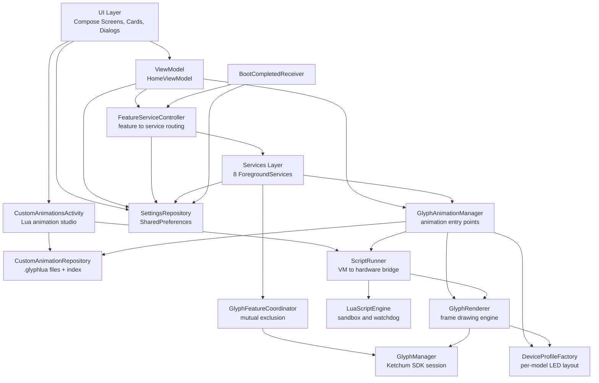

# Glyph Sharge (Glyph Zen) — Project Documentation

> Complete technical guide for developers. Current for version **1.0.31** (versionCode 1031).
> Russian version: [DOCUMENTATION_RU.md](DOCUMENTATION_RU.md)

---

## Table of Contents

1. [Project Overview](#1-project-overview)
2. [Requirements & Getting Started](#2-requirements--getting-started)
3. [Architecture](#3-architecture)
4. [Glyph Layer](#4-glyph-layer)
5. [Data Layer](#5-data-layer)
6. [Services](#6-services)
7. [**Adding a New Service (Quickstart)**](#7-adding-a-new-service-quickstart)
8. [UI Layer](#8-ui-layer)
9. [Navigation](#9-navigation)
10. [Music visualiser](#10-music-visualiser)
11. [Resources & Localization](#11-resources--localization)
12. [Build & Configuration](#12-build--configuration)
13. [Known Issues & Gotchas](#13-known-issues--gotchas)
14. [**Custom Animations (Lua)**](#14-custom-animations-lua)

---

## 1. Project Overview

**Glyph Sharge** is an app for controlling the **Nothing Glyph** light interface on Nothing phones.
It gives full control over the LEDs: charge indication, notifications, security, personalization.

> ⚠️ This is **not** an official Nothing Technology Limited product.

### Key Features

| Area | Capabilities |
|------|--------------|
| 🔌 Power | Charging animations, battery level display, low-battery alerts, Power Peek (shake to check battery) |
| 🔒 Security | Pulse Lock (animation on unlock), Screen Off (animation on lock) |
| 📡 Integration | NFC glyphs on payment events |
| 🎨 Personalization | 6 theme styles, Nothing fonts (NType Headline, NDot 55 Caps), scalable text sizes, your own glyph animations written in Lua |
| ⚙️ System | Quiet hours, boot persistence, logging |

### Supported Devices

| Device | Model | Status |
|--------|-------|--------|
| Nothing Phone (1) | 20111 | No testers |
| Nothing Phone (2) | 22111 | No testers |
| Nothing Phone (2a) | 23111 / 23113 | No testers |
| Nothing Phone (3a) | 24111 | ✅ Full support |

Device detection happens in [DeviceType](../app/src/main/java/com/bleelblep/glyphsharge/glyph/device/DeviceType.kt)
via `Common.is20111()` and friends. On an unsupported device the app still
launches, but the glyphs will not work.

### Key Project Facts

| Parameter | Value |
|-----------|-------|
| Package / namespace | `com.bleelblep.glyphsharge` |
| Application ID | `com.bleelblep.glyphsharge` |
| minSdk / targetSdk | **34** / 34 (Android 14+) |
| compileSdk | 36 |
| JVM target | 17 |
| Language | Kotlin 1.9.10, Jetpack Compose (Material 3) |
| DI | Hilt 2.50 (KSP + kapt) |
| Settings storage | SharedPreferences (file `glyphzen_settings`) |
| Animation scripts | LuaJ 3.0.1 (`org.luaj:luaj-jse`) — a pure-JVM Lua 5.2 |
| Glyph SDK | `app/libs/KetchumSDK_Community_20250319.jar` (official Nothing key) |

> [!IMPORTANT]
> There is **no debug mode for glyphs** — the app uses the official Nothing API key
> declared in `AndroidManifest.xml` as `<meta-data android:name="NothingKey" .../>`.
> There is no need to substitute `"test"`.

---

## 2. Requirements & Getting Started

### Requirements

- **JDK 17** (mandatory — the active build script sets `sourceCompatibility 17`)
- **Android Studio** Hedgehog (2023.1.1) or newer
- **Android SDK** 36 (compile), 34 (min)
- A physical Nothing phone to verify glyphs

### Clone & Build

```bash
git clone https://github.com/hardWorker254/Glyph-Sharge-fork.git
cd Glyph-Sharge-fork
```

Open in Android Studio, wait for the Gradle sync, then:

```bash
# Debug build and install
./gradlew app:assembleDebug
./gradlew app:installDebug

# Release build
./gradlew app:assembleRelease
```

> [!WARNING]
> **`app/build.gradle` (Groovy) is the active script, NOT `app/build.gradle.kts`.**
> Gradle always prefers the Groovy script. This matters: the `.kts` file declares a different
> namespace (`com.bleelblep.glyphzenredesign`), different versions, and enables R8.
> Treat the Groovy file as the source of truth.

### Testing on Device

An emulator has no glyphs. Test on a real Nothing Phone.
The app still launches without one — `isNothingPhone()` returns `false` and the feature
cards stay inactive, so UI work can be done on any device.

---

## 3. Architecture

The project follows **MVVM + Unidirectional Data Flow + Repository + Hilt DI**.



### Layers

| Layer | Package | Responsibility |
|-------|---------|----------------|
| **Glyph** | `glyph/` | Nothing SDK session, low-level channel work, all animations, LED access arbitration. Split into `device/` (per-model layout), `engine/` (frame drawing), `animations/` and `battery/` (the effects), `script/` (user-written Lua animations) |
| **Data** | `data/` | User settings, migrations, defaults |
| **Services** | `services/` | Foreground services reacting to system events |
| **UI** | `ui/` | Compose screens, cards, dialogs, themes, fonts, navigation |
| **DI** | `di/` | `@EntryPoint` used to reach the Hilt graph from composable context |
| **Utils** | `utils/` | Logging, watermarks |
| **Receiver** | `receiver/` | Restores services after reboot |

### Directory Structure

```
app/src/main/java/com/bleelblep/glyphsharge/
├── GlyphZenApplication.kt      # @HiltAndroidApp (class GlyphShargeApplication)
├── MainActivity.kt             # Entry point, the only Activity of the app proper
├── CustomAnimationsActivity.kt # The Lua animation studio (separate Activity, not in the NavHost)
├── glyph/
│   ├── GlyphManager.kt         # SDK session, device registration
│   ├── GlyphAnimationManager.kt# Public façade: the animation entry points
│   ├── GlyphFeatureCoordinator.kt # Mutex + enum GlyphFeature (glyph layer)
│   ├── AnimationCatalog.kt     # enum GlyphAnimationId (the settings id strings)
│   ├── device/                 # Per-model LED layout and timings
│   │   ├── DeviceType.kt       # Model detection, in one place
│   │   ├── DeviceProfile.kt    # Profile data classes
│   │   └── DeviceProfileFactory.kt
│   ├── engine/                 # Frame building, run flag, error handling
│   │   └── GlyphRenderer.kt
│   ├── animations/             # The animations themselves
│   │   ├── SequenceAnimations.kt
│   │   └── ParticleAnimations.kt
│   ├── script/                 # User-written Lua animations
│   │   ├── ScriptAnimation.kt  # Model: name, source, id shaped custom:<12 hex>
│   │   ├── ScriptFileFormat.kt # The .glyphlua container (encode/decode/file name)
│   │   ├── LuaScriptEngine.kt  # LuaJ: the sandbox, the watchdog, validate()
│   │   ├── ScriptSession.kt    # Per-run state: deadline, budget, interruptible waits
│   │   ├── GlyphLuaApi.kt      # The glyph table — the whole language for a script
│   │   └── ScriptRunner.kt     # The only place the VM meets real hardware
│   └── battery/                # Charging and power-peek bar
│       ├── BatteryState.kt
│       └── BatteryGlyphAnimator.kt
├── data/
│   ├── SettingsRepository.kt   # SharedPreferences
│   └── CustomAnimationRepository.kt # Script files + index, export through MediaStore
├── services/
│   ├── GlyphForegroundService.kt   # Master service
│   ├── FeatureServiceController.kt # Single feature-to-service mapping
│   ├── ChargingAnimationService.kt
│   ├── PowerPeekService.kt
│   ├── PulseLockService.kt
│   ├── ScreenOffGlyphService.kt
│   ├── NfcGlyphService.kt
│   ├── LowBatteryAlertService.kt
│   └── QuietHoursService.kt
├── receiver/
│   └── BootCompletedReceiver.kt
├── ui/
│   ├── components/            # Cards, dialogs, layout
│   │   ├── FeatureCards.kt    # 6 feature cards
│   │   ├── GlyphAnimations.kt # The animation catalogue + rememberAnimationOptions()
│   │   ├── cards/             # ContentCard, FeatureCard, WideFeatureCardWithToggle
│   │   ├── controls/          # MorphingToggleButton
│   │   ├── dialogs/           # FeatureDialogScaffold, FeatureConfirmationFlow
│   │   └── layout/            # SettingsScaffold, DraggableSettingsCard
│   ├── screens/               # Screens
│   │   └── animations/       # Studio: list, editor, preview
│   ├── navigation/            # Routes, GlyphNavHost
│   ├── state/                 # enum GlyphFeature (UI layer), HomeUiState
│   ├── theme/                 # Themes, fonts, typography
│   ├── utils/                 # HapticUtils
│   └── viewmodel/             # HomeViewModel, AnimationStudioViewModel
├── utils/
│   ├── LoggingManager.kt
│   └── WatermarkHelper.kt
└── di/
    ├── AppModule.kt
    └── GlyphComponent.kt      # Entry point: GlyphAnimationManager + CustomAnimationRepository
```

### Key Architectural Decisions

**One place routes features to services.** [FeatureServiceController](../app/src/main/java/com/bleelblep/glyphsharge/services/FeatureServiceController.kt)
decides which service backs which feature. This mapping used to be written out four times
(`MainActivity.initializeServices`, both toggle handlers, `syncServicesAfterToggle`), and adding
a feature meant editing all of them. It is now declared once, and both the Activity and the
ViewModel drive services through the same object.

**Mutual exclusion over the LEDs.** Several services may want the glyphs at once.
[GlyphFeatureCoordinator](../app/src/main/java/com/bleelblep/glyphsharge/glyph/GlyphFeatureCoordinator.kt)
holds a `Mutex` — only one feature owns the LEDs at a time. The second gets a refusal after
500 ms and yields gracefully.

**User-written animations are a separate engine behind the existing façade.** The Lua
scripts got neither their own branch inside the services nor their own renderer. A feature
still stores one id string, and `GlyphAnimationManager.playAnimation(id, durationMs)` checks
`ScriptAnimation.isCustomId(id)` **before** the built-in `GlyphAnimationId.of(id)` lookup and
hands over to `ScriptRunner`:

```
feature setting (an id shaped custom:<12 hex>)
  → CustomAnimationRepository (source lookup)
  → GlyphAnimationManager.playAnimation
  → ScriptRunner.runScript          (Dispatchers.Default, RendererHost)
  → LuaScriptEngine.run             (LuaJ, sandbox + watchdog)
  → GlyphRenderer → GlyphManager    (the LEDs)
```

A script goes through the **same** `anim { }` guard with the same strip blanking as a built-in
animation, which is why the feature's Duration setting bounds it exactly as it bounds the
rest. Details in [section 14](#14-custom-animations-lua).

**The studio is a separate Activity, not a NavHost route.**
[CustomAnimationsActivity](../app/src/main/java/com/bleelblep/glyphsharge/CustomAnimationsActivity.kt)
is declared with `android:exported="false"` and `parentActivityName=".MainActivity"`.
It owns its own back stack (a `BackHandler` between the list and the editor) and its own
`ActivityResultLauncher`s for `OpenDocument`/`CreateDocument` — system file dialogs should
not leak into the shared settings navigation graph. A new card in `SettingsScreen`
(`settings_card_custom_animations`, with the saved-script count) launches it.

> [!CAUTION]
> **There are two different `GlyphFeature` enums in the project:**
> - `ui/state/FeatureModels.kt` — 6 values (only the ones actually used), for UI and `FeatureServiceController`
> - `glyph/GlyphFeatureCoordinator.kt` — 9 values (including unused `GLYPH_GUARD`, `BATTERY_STORY`, `MANUAL_DEMO`), for LED arbitration
>
> When adding a feature **you must change both**. See [section 7](#7-adding-a-new-service-quickstart).

---

## 4. Glyph Layer

### GlyphManager

`@Singleton`, constructor-injected. A wrapper over the official `com.nothing.ketchum` SDK.
It owns **only** the SDK session — no animation logic, no hard-coded channel numbers.

```kotlin
fun initialize()                 // SDK init, lazy mCallback, bind the system service
fun isNothingPhone(): Boolean    // device model check
fun openSession()                // open the glyph session
fun closeSession()               // close the session
val isSessionActive: Boolean     // session state
val isServiceConnected: Boolean  // is the Nothing service bound
var onSessionStateChanged: ((Boolean) -> Unit)?  // SDK → UI state mirror
fun forceEnsureSession(): Boolean// blocking wait for readiness (up to 2 s)
fun toggleGlyphService(): Boolean
fun turnOffAll()                 // turn every LED off
fun turnOnAllGlyphs()            // light every channel of the connected model
fun canPerformOperation(): Boolean
fun cleanup()
```

**Session lifecycle:**

1. `GlyphShargeApplication.onCreate` → `if (isNothingPhone()) glyphManager.initialize()`
2. `GlyphManager.mCallback.onServiceConnected` → `DeviceType.detect()` → `mGM.register(id)`
3. `HomeViewModel.toggleGlyphService(true)` → `openSession()`
4. `GlyphFeatureCoordinator.acquire()` → if the session is not active, `forceEnsureSession()`
5. `onStop` / `onDestroy` → when the preference is off, `closeSession()` + `cleanup()`

**Device detection** is centralised in `DeviceType.detect()`. The enum carries both the
`Common.is*` check and the SDK registration id, so "which phone is this?" is asked in exactly
one place instead of five `when` chains.

> [!NOTE]
> `forceEnsureSession()` uses a blocking `Thread.sleep(100)` in a loop for up to 2 seconds.
> It is called from `GlyphFeatureCoordinator.acquire()` through `withContext(Dispatchers.IO)`,
> so it blocks an IO thread for the whole wait if the Nothing service never binds.

### GlyphRenderer

`@Singleton`, constructor-injected. The **only** class that touches `GlyphManager.mGM` directly.
Animations are written as `suspend` extensions on it, which is what keeps the three shared
concerns in one place:

| Method | Purpose |
|--------|---------|
| `val isRunning: Boolean` | set by `start()` / `stop()`, polled by every animation loop |
| `turnOff()` | blank the strip; never throws |
| `frame(channels, brightness)` | a builder with channels lit at one brightness, or `null` |
| `builder()` | an empty builder, for per-channel brightness ramps |
| `toggle(builder, delayMs)` | show a frame, then optionally wait |
| `toggleChannels(channels, brightness, delayMs)` | `frame` + `toggle` |
| `pulse(channels, onMs, offMs, brightness)` | the "on, off, wait" primitive everything is built from |
| `onError(e, message, retryDelayMs)` | log a failed step and keep going — but rethrows `CancellationException` |

`GLYPH_MAX_BRIGHTNESS = 4000` is a top-level constant in the same file.

### GlyphAnimationManager

`@Singleton`. A thin façade — **every public entry point is `suspend`** and none of them
draw anything themselves. It injects `GlyphManager` (guards), `GlyphRenderer` (the engine)
and `SettingsRepository` (what to play), and holds one lazily resolved `DeviceProfile?`
(`null` on unsupported hardware).

**Base animations** (all `suspend`):

| Function | Description |
|----------|-------------|
| `runWaveAnimation()` | Wave across segment groups |
| `runBeedahAnimation()` | Same rhythm without the pause between groups |
| `runSpiralAnimation()` | Spiral sweep with a 0.6 → 1.0 brightness ramp |
| `runC1SequentialAnimation()` | Sequential pass along the C strip, forward and back |
| `runLockPulseAnimation()` | "Padlock": a widening wedge 0.3 → 1.0 |
| `runPulseEffect(cycles: Int = 3)` | Blink, 300 ms on / 300 ms off |
| `runHeartbeatAnimation()` | Three "lub-dub" beats |
| `runMatrixRainAnimation()` | Falling drops with tails |
| `runFireworksAnimation()` | Launches and explosions with fade-out |
| `runDNAHelixAnimation()` | Two counter-rotating strands |

**Feature scenarios** — wrappers that check settings and call a base animation:

```kotlin
suspend fun playPulseLockAnimation()
suspend fun playLowBatteryAnimation()
suspend fun playScreenOffAnimation()
suspend fun playNfcAnimation()
suspend fun playPowerPeekAnimation(context: Context, onProgressUpdate: (Float) -> Unit = {})
suspend fun playChargingAnimationAnimation(context: Context, onProgressUpdate: (Float) -> Unit = {})
fun stopAnimations()
```

**Dispatch by id.** A private `playAnimation(id, durationMs)` first checks whether the id is a
user one (`ScriptAnimation.isCustomId(id)` → the `custom:` prefix) and, if so, calls
`playCustomAnimation(id, durationMs)`. Only otherwise is the stored id resolved through
`GlyphAnimationId.of(id)` and run through a `when` over the enum:

| id | Animation |
|----|-----------|
| `C1` | `runC1SequentialAnimation()` |
| `WAVE` | `runWaveAnimation()` |
| `BEEDAH` | `runBeedahAnimation()` |
| `LOCK` | `runLockPulseAnimation()` |
| `SPIRAL` | `runSpiralAnimation()` |
| `HEARTBEAT` | `runHeartbeatAnimation()` |
| `MATRIX` | `runMatrixRainAnimation()` |
| `FIREWORKS` | `runFireworksAnimation()` |
| `DNA` | `runDNAHelixAnimation()` |
| `PULSE` + everything else | `runPulseEffect(cycles)` |

> [!NOTE]
> `durationMs` is used **only** in the `PULSE` branch (`cycles = duration / 500`).
> Named animations run their own natural length and ignore the duration setting.
> For a user script `durationMs` is the opposite — a hard ceiling on the run.

**Custom animations.** Three new public methods, one changed one:

| Method | Purpose |
|--------|---------|
| `suspend fun playCustomAnimation(runtimeId: String, durationMs: Long): ScriptRunResult` | Runs a stored script by its `custom:` id. Checks the service toggle and `isNothingPhone()`, looks the source up in `CustomAnimationRepository` |
| `suspend fun previewScript(source: String, durationMs: Long): ScriptRunResult` | Runs an unsaved source from the editor. **No** service-toggle check: the studio is an explicit user action |
| `fun checkScript(source: String): String?` | Compiles without running, the Check button. `null` means the syntax is fine |
| `fun stopAnimations()` | Now also calls `scriptRunner.stop()`, so a script is interrupted too |

All three go through a private `playScript { }`: blank the strip, run the block, blank it
again in a `finally`, and turn any exception into a `ScriptRunResult(RUNTIME_ERROR, …)` —
nothing escapes. The façade's constructor now injects `CustomAnimationRepository`
and `ScriptRunner` as well.

**The `anim { }` guard.** Every base animation runs inside a private wrapper that checks the
service toggle and the device support, blanks the strip, runs the body, and blanks it again
in a `finally`. The body is a `suspend GlyphRenderer.(DeviceProfile) -> Unit`, so animations
read as `anim { runWaveAnimation(it) }`.

> [!TIP]
> The catalogue is an enum now: `GlyphAnimationId` in `glyph/AnimationCatalog.kt` owns the id
> strings, so a typo in a setting is a compile-time-visible mismatch rather than a silent
> fall-through to the pulse effect.

### The animation implementations

All drawing code lives outside `GlyphAnimationManager`, grouped by concern:

| File | Contents |
|------|----------|
| `glyph/animations/SequenceAnimations.kt` | wave, beedah, pulse, heartbeat, C1, lock, spiral |
| `glyph/animations/ParticleAnimations.kt` | matrix rain, fireworks, DNA helix |
| `glyph/battery/BatteryGlyphAnimator.kt` | the charging / power-peek battery bar and its accents |
| `glyph/battery/BatteryState.kt` | `BatteryState` + `BatteryStateReader` (sticky broadcast) |
| `glyph/engine/GlyphRenderer.kt` | frame building, the run flag, error handling, `pulse` |
| `glyph/device/DeviceProfileFactory.kt` | the per-model channel layouts and timings |
| `glyph/device/DeviceType.kt` | the single source of truth for model detection |
| `glyph/device/DeviceProfile.kt` | `DeviceProfile`, `AnimGroup`, and the three tuning configs |
| `glyph/script/LuaScriptEngine.kt` | The LuaJ sandbox, the watchdog, `validate()` |
| `glyph/script/GlyphLuaApi.kt` | The `glyph` table — the whole user-facing language |
| `glyph/script/ScriptRunner.kt` | The only place the VM is joined to `GlyphRenderer` |

Two conventions make the animations readable:

- every loop starts with `if (!isRunning) return` — that is what makes `stopAnimations()`
  take effect within one step instead of at the end of a 5-second sequence;
- an animation that cannot light a frame uses `builder() ?: break` rather than crashing, so
  the sequence degrades to the frames that do work.

The UI catalogue is the `GlyphAnimations` object in
[ui/components/GlyphAnimations.kt](../app/src/main/java/com/bleelblep/glyphsharge/ui/components/GlyphAnimations.kt):
10 `GlyphAnim(id, displayName, iconRes, isCustom = false)` entries and `getById(id, options)`
falling back to the first entry. `withCustomAnimations(custom)` appends the user's scripts
**after** the built-ins, so the chip row keeps a stable layout. The composable
`rememberAnimationOptions()` reads the repository through `GlyphComponent` (the feature
dialogs are plain Composables, not ViewModels) and returns a list backed by a `StateFlow`.
`PulseLock`, `LowBattery`, `NfcGlyph` and `ScreenOff` use it, and each of their Test buttons
gained a branch: `if (selectedAnimation.isCustom) playCustomAnimation(id, duration)`.

### GlyphFeatureCoordinator

```kotlin
val currentOwner: StateFlow<GlyphFeature?>
suspend fun acquire(owner: GlyphFeature, timeoutMs: Long = 500L): Boolean
fun release(owner: GlyphFeature)
```

`acquire()` grabs the `Mutex` with a timeout, sets `_currentOwner` on success, and raises the
glyph session if needed. `release()` turns the LEDs off **first** (`turnOffAll()`), and only
then hands the mutex to the next owner — calls from a non-owner are ignored.

---

## 5. Data Layer

### SettingsRepository

`@Singleton`, constructor-injected with `@ApplicationContext`. Storage is
**SharedPreferences**, file `glyphzen_settings`. There are no `Flow`/`StateFlow` — every getter
is synchronous, and screens poll via `remember` plus `refreshFeatures()` in `onResume`.

The `init` block does three things on first creation:

1. `applyFirstRunDefaults()` — guarded by a `first_run_completed` flag, writes `false` for every
   feature flag, `HEADLINE` for the font, `use_custom_fonts = true`, scales `1.0f`.
2. `applyVersionMigrations()` — four steps (`< 109`, `< 110`, `< 111`, `< 112`), each checking
   `prefs.contains(KEY)` before writing so a lost version marker cannot wipe user toggles.
3. `normalizeLegacyVibrationIntensity()` — converts the legacy `1..255` vibration value
   into a `0.1f..1.0f` scale.

This is exactly why `GlyphShargeApplication.onCreate` touches the repository **before anything
else** — it guarantees defaults are written before any component can read them.

**Public API (grouped):**

| Group | Methods |
|-------|---------|
| Theme | `saveTheme` / `getTheme`, `saveThemeStyle` / `getThemeStyle` |
| Font | `saveFontVariant` / `getFontVariant`, `saveUseCustomFonts` / `getUseCustomFonts`, `saveFontSizeSettings` / `getFontSizeSettings`, `clearFontSizeCustomization`, `getFontSizeSettingsForFont` |
| Master switch | `saveGlyphServiceEnabled` / `getGlyphServiceEnabled` |
| Power Peek | `savePowerPeekEnabled` / `isPowerPeekEnabled`, `savePowerPeekThreshold` / `getPowerPeekThreshold`, `getShakeIntensityLevel`, `savePowerPeekDuration` / `getPowerPeekDuration`, `saveVibrationIntensity` / `getVibrationIntensity` |
| Pulse Lock | `savePulseLockEnabled` / `isPulseLockEnabled`, `…AnimationId`, `…Duration` |
| Low Battery | `saveLowBatteryEnabled` / `isLowBatteryEnabled`, `…Threshold`, `…AnimationId`, `…Duration` |
| Screen Off | `saveScreenOffFeatureEnabled` / `isScreenOffFeatureEnabled`, `…AnimationId`, `…Duration` |
| NFC | `saveNfcFeatureEnabled` / `isNfcFeatureEnabled`, `…AnimationId`, `…AnimationDuration` |
| Charging | `saveChargingAnimationEnabled` / `isChargingAnimationEnabled`, `…Duration` |
| Quiet hours | `saveQuietHoursEnabled` / `isQuietHoursEnabled`, `saveQuietHoursStartHour/Minute`, `saveQuietHoursEndHour/Minute`, `isCurrentlyInQuietHours()` |
| Language | `getAppLanguageCode` / `saveAppLanguageCode` |
| Debug | `dumpAllSettings()` (writes to Logcat only when `Log.isLoggable`) |

Public constants: `SHAKE_SOFT=12.0f`, `SHAKE_EASY=15.0f`, `SHAKE_MEDIUM=18.0f`,
`SHAKE_HARD=22.0f`, `SHAKE_HARDEST=28.0f`.

> [!NOTE]
> The charging animation has **no** animation-selection setting (`saveChargingAnimationId`
> does not exist) — it always uses the fixed `playChargingAnimationAnimation`.

### CustomAnimationRepository

`@Singleton`, the second repository of the data layer — for the user's own animations.
[CustomAnimationRepository.kt](../app/src/main/java/com/bleelblep/glyphsharge/data/CustomAnimationRepository.kt)

**Sources in files, the index in preferences.** A script is edited often and can grow past
what a preference value should hold, so each one lives in its own file at
`filesDir/glyph_scripts/<id>.glyphlua`, while SharedPreferences
`glyphsharge_custom_animations` only holds a compact JSON array (`org.json`) — enough to draw
the list without touching the disk.

The list is exposed as a `StateFlow<List<ScriptAnimation>>`: the animation pickers on the
Pulse Lock, Low Battery, NFC and Screen Off cards are several screens away from the editor,
so saving a script has to update the chips everywhere at once.

| Group | Methods |
|-------|---------|
| Read | `reload()`, `getById(id)`, `findByRuntimeId(runtimeId)`, `animations: StateFlow` |
| Write | `draft(template)`, `save(animation)`, `rename(id, name)`, `delete(id)`, `duplicate(id)` |
| Import | `suspend readText(uri)`, `suspend importFrom(text, fallbackName)` |
| Export | `suspend exportTo(uri, animation)` (system file picker), `suspend exportToDownloads(animation)` (MediaStore) |

> [!IMPORTANT]
> **Import always assigns a fresh id** (`ScriptAnimation.newId()`), even when the file header
> carries a foreign one. Otherwise importing a file that is already on the phone would
> silently overwrite the local copy. Names are de-duplicated with a `(2)`, `(3)`… suffix —
> two identical names are indistinguishable in a chip row.
>
> `exportToDownloads()` goes through `MediaStore.Downloads` with the `IS_PENDING` protocol
> (API 29+), so **no permission is required**; `exportTo(uri)` works through
> `ActivityResultContracts.CreateDocument`.

`STARTER_SCRIPT` is the template a brand new animation starts from. It deliberately uses
only `glyph.ch.all`/`glyph.ch.c` and never hard-codes a channel number, so it works on every
supported phone.


---

## 6. Services

### Overview

| Service | Purpose | Trigger |
|---------|---------|---------|
| `GlyphForegroundService` | Persistent notification, keeps the process alive. Owns no LED logic | `FeatureServiceController.stopAll()` |
| `ChargingAnimationService` | Animation on charger connect/disconnect | `POWER_CONNECTED` / `POWER_DISCONNECTED` |
| `PowerPeekService` | Battery check by shaking while the screen is off | Accelerometer |
| `PulseLockService` | Animation on device unlock | `ACTION_USER_PRESENT` |
| `ScreenOffGlyphService` | Animation on screen lock | `ACTION_SCREEN_OFF` |
| `NfcGlyphService` | Animation on NFC event | NFC Intent via the Activity |
| `LowBatteryAlertService` | Low battery notification | `ACTION_BATTERY_CHANGED` |
| `QuietHoursService` | Silence during a scheduled window | `AlarmManager` |
| `MusicVisualizerService` | Spectrum visualisation of whatever is playing | `Visualizer` + `AudioManager` |

### Service Lifecycle Contract

Every feature service must implement **all six** points:

```kotlin
@AndroidEntryPoint
class MyService : Service() {

    @Inject lateinit var settingsRepository: SettingsRepository
    @Inject lateinit var glyphAnimationManager: GlyphAnimationManager
    @Inject lateinit var featureCoordinator: GlyphFeatureCoordinator

    // 1. Action constants
    companion object {
        const val ACTION_START = "com.bleelblep.glyphsharge.MY_FEATURE_START"
        const val ACTION_STOP  = "com.bleelblep.glyphsharge.MY_FEATURE_STOP"
        private const val TAG = "MyService"
        private const val NOTIF_ID = 1020
        private const val NOTIF_CHANNEL_ID = "MyServiceChannel"
    }

    // 2. Creation: notification channel, WakeLock, receivers
    override fun onCreate() {
        super.onCreate()
        createNotificationChannel()
        registerReceivers()
    }

    // 3. Start: startForeground() in the first lines
    override fun onStartCommand(intent: Intent?, flags: Int, startId: Int): Int {
        startForeground(NOTIF_ID, buildNotification())
        if (intent?.action == ACTION_STOP) { shutDown(); return START_NOT_STICKY }
        if (!settingsRepository.getGlyphServiceEnabled() || !settingsRepository.isMyFeatureEnabled()) {
            shutDown(); return START_NOT_STICKY
        }
        return START_STICKY
    }

    // 4. Destruction: unregister receivers, release WakeLock, cancel coroutines
    override fun onDestroy() {
        runCatching { unregisterReceiver(myReceiver) }
        runCatching { wakeLock?.takeIf { it.isHeld }?.release() }
        serviceJob.cancel()
        super.onDestroy()
    }

    // 5. The service does not bind
    override fun onBind(intent: Intent?): IBinder? = null

    // 6. Self-restart after being swiped from recents
    override fun onTaskRemoved(rootIntent: Intent?) {
        super.onTaskRemoved(rootIntent)
        if (!settingsRepository.getGlyphServiceEnabled()) return
        startForegroundService(Intent(this, MyService::class.java).apply { action = ACTION_START })
    }
}
```

### Rules That Must Not Be Broken

> [!IMPORTANT]
> 1. **`startForeground()` at the top of `onStartCommand`** — otherwise Android 12+ throws
>    `ForegroundServiceDidNotStartInTimeException`.
> 2. **All 8 services use `foregroundServiceType="specialUse"`** and must declare their
>    `android.app.PROPERTY_SPECIAL_USE_FGS_SUBTYPE` in the manifest — a Google Play requirement.
> 3. **Guard every trigger in three layers**: the master `getGlyphServiceEnabled()`, the
>    feature's own flag, and quiet hours `isCurrentlyInQuietHours()`.
> 4. **Always `runCatching { release() }`** around WakeLock and `unregisterReceiver` — both
>    throw if the resource was never acquired.
> 5. **Always `featureCoordinator.release()` in a `finally` block** — otherwise the mutex
>    stays held and every other feature freezes.
> 6. **A watchdog coroutine** caps the animation by the duration setting, even when the
>    animation itself runs longer.

### Canonical Animation Trigger

```kotlin
private fun triggerMyFeature() {
    animationScope.launch {
        if (!settingsRepository.getGlyphServiceEnabled()) return@launch
        if (!settingsRepository.isMyFeatureEnabled()) return@launch
        if (!settingsRepository.isCurrentlyInQuietHours()) return@launch
        if (!featureCoordinator.acquire(GlyphFeature.MY_FEATURE)) return@launch

        val duration = settingsRepository.getMyFeatureDuration()
        runCatching { wakeLock.acquire(duration + 1000L) }

        try {
            val animJob = launch(Dispatchers.Default) {
                glyphAnimationManager.playMyFeatureAnimation()
            }
            val watchdogJob = launch {
                delay(duration.milliseconds)
                animJob.cancelAndJoin()
                glyphAnimationManager.stopAnimations()
            }
            animJob.join()
            watchdogJob.cancel()
        } catch (e: Exception) {
            Log.e(TAG, "Error in my feature sequence", e)
        } finally {
            featureCoordinator.release(GlyphFeature.MY_FEATURE)
            runCatching { if (wakeLock.isHeld) wakeLock.release() }
        }
    }
}
```

### FeatureServiceController

The single place describing the "feature → service → setting" relationship. Its four `when`
expressions are **exhaustive** (no `else`), so adding an enum value makes the compiler point
at every site for you:

```kotlin
private fun serviceOf(feature: GlyphFeature): Class<out Service> = when (feature) { ... }
private fun stopActionOf(feature: GlyphFeature): String          = when (feature) { ... }
fun isEnabled(feature: GlyphFeature): Boolean                   = when (feature) { ... }
fun saveEnabled(feature: GlyphFeature, enabled: Boolean)         { when (feature) { ... } }
```

Public API: `readAll()`, `start(feature)`, `stop(feature)`, `apply(feature, enabled)`,
`startAllEnabled()`, `stopAll()`.

`startAllEnabled()` and `stopAll()` iterate `GlyphFeature.entries`, so a new feature is picked
up automatically — there is nothing to register separately.

### BootCompletedReceiver

`@AndroidEntryPoint`, works via `goAsync()` + `Dispatchers.IO`. Restores in two tiers with a
`TIER2_DELAY_MS = 100L` delay:

1. **Tier 1** — `GlyphForegroundService`, if the master switch is on.
2. **Tier 2** — the six features in order: PowerPeek, LowBattery, PulseLock, ScreenOff, NFC,
   Charging Animation. Each guarded by its own flag **and** by the shared `glyphOn`.
3. **Quiet hours** — last, independent of the glyphs.

---

## 7. Adding a New Service (Quickstart)

> [!TIP]
> This is the step-by-step procedure for **adding a new feature with its own foreground
> service**, modelled on `PowerPeekService` / `LowBatteryAlertService`.
> Example: a "Step Counter" feature.

The order is **bottom-up** (data → core → service → manifest → UI) so the project either
compiles at every moment or fails with a comprehensible compiler error.

### Change Map

| # | Step | File |
|---|------|------|
| 1 | Settings key and accessors | [SettingsRepository.kt](../app/src/main/java/com/bleelblep/glyphsharge/data/SettingsRepository.kt) |
| 2 | Enum value (UI layer) | [FeatureModels.kt](../app/src/main/java/com/bleelblep/glyphsharge/ui/state/FeatureModels.kt) |
| 3 | Enum value (glyph layer) | [GlyphFeatureCoordinator.kt](../app/src/main/java/com/bleelblep/glyphsharge/glyph/GlyphFeatureCoordinator.kt) |
| 4 | Playback function | [GlyphAnimationManager.kt](../app/src/main/java/com/bleelblep/glyphsharge/glyph/GlyphAnimationManager.kt) |
| 5 | The service itself | **new** `services/StepCounterService.kt` |
| 6 | Routing | [FeatureServiceController.kt](../app/src/main/java/com/bleelblep/glyphsharge/services/FeatureServiceController.kt) |
| 7 | Manifest declaration | [AndroidManifest.xml](../../app/src/main/AndroidManifest.xml) |
| 8 | Strings | `res/values/strings.xml` + `res/values-ru-rRU/strings.xml` |
| 9 | Configuration dialogs | **new** `ui/components/StepCounter.kt` |
| 10 | Card | [FeatureCards.kt](../app/src/main/java/com/bleelblep/glyphsharge/ui/components/FeatureCards.kt) |
| 11 | Home screen entry | [HomeFeatures.kt](../app/src/main/java/com/bleelblep/glyphsharge/ui/screens/home/HomeFeatures.kt) |
| 12 | Test button | [HomeViewModel.kt](../app/src/main/java/com/bleelblep/glyphsharge/ui/viewmodel/HomeViewModel.kt) |
| 13 | Boot restoration | [BootCompletedReceiver.kt](../app/src/main/java/com/bleelblep/glyphsharge/receiver/BootCompletedReceiver.kt) |

---

### Step 1. Settings in `SettingsRepository`

Add the key to the `companion object`:

```kotlin
private const val KEY_STEP_COUNTER_ENABLED = "step_counter_enabled"
private const val KEY_STEP_COUNTER_DURATION = "step_counter_duration"
```

Add accessors (next to the equivalents for other features):

```kotlin
fun saveStepCounterEnabled(enabled: Boolean) =
    prefs.edit { putBoolean(KEY_STEP_COUNTER_ENABLED, enabled) }

fun isStepCounterEnabled(): Boolean =
    prefs.getBoolean(KEY_STEP_COUNTER_ENABLED, false)

fun saveStepCounterDuration(durationMs: Long) =
    prefs.edit { putLong(KEY_STEP_COUNTER_DURATION, durationMs) }

fun getStepCounterDuration(): Long =
    prefs.getLong(KEY_STEP_COUNTER_DURATION, 3000L)
```

And add the default in `applyVersionMigrations()` as a new `< 113` step:

```kotlin
if (lastVersion < 113) {
    if (!prefs.contains(KEY_STEP_COUNTER_ENABLED)) {
        prefs.edit { putBoolean(KEY_STEP_COUNTER_ENABLED, false) }
    }
    prefs.edit { putInt(KEY_LAST_MIGRATED_VERSION, 113) }
}
```

> [!TIP]
> The `prefs.contains(...)` guard is mandatory — without it, a user who already enabled
> the feature loses that setting on update.

---

### Step 2. `GlyphFeature` enum (UI layer)

In [FeatureModels.kt](../app/src/main/java/com/bleelblep/glyphsharge/ui/state/FeatureModels.kt:15):

```kotlin
enum class GlyphFeature {
    CHARGING_ANIMATION,
    POWER_PEEK,
    PULSE_LOCK,
    SCREEN_OFF,
    NFC,
    LOW_BATTERY,
    STEP_COUNTER          // ← new
}
```

---

### Step 3. `GlyphFeature` enum (glyph layer)

In [GlyphFeatureCoordinator.kt](../app/src/main/java/com/bleelblep/glyphsharge/glyph/GlyphFeatureCoordinator.kt:61)
add the **same name** to the second enum:

```kotlin
enum class GlyphFeature {
    PULSE_LOCK,
    POWER_PEEK,
    GLYPH_GUARD,
    BATTERY_STORY,
    MANUAL_DEMO,
    LOW_BATTERY,
    SCREEN_OFF,
    NFC,
    CHARGING_ANIMATION,
    STEP_COUNTER          // ← new
}
```

> [!CAUTION]
> These enums are **different types with the same name**. Import the one you need explicitly.
> `FeatureServiceController` and the ViewModel use the enum from `ui.state`,
> while services work with the enum from `glyph`.

---

### Step 4. Playback function in `GlyphAnimationManager`

Add a scenario following the existing ones:

```kotlin
suspend fun playStepCounterAnimation() {
    if (!settingsRepository.getGlyphServiceEnabled()) return
    playAnimation(
        settingsRepository.getStepCounterAnimationId(),
        settingsRepository.getStepCounterDuration()
    )
}
```

If you need a **brand-new animation** rather than an existing one:

1. Implement it as a `suspend` extension on `GlyphRenderer` in the right file —
   `glyph/animations/SequenceAnimations.kt` for a fixed sequence,
   `glyph/animations/ParticleAnimations.kt` for a randomised one. Use `frame()`,
   `toggle()` or `pulse()`, and check `isRunning` inside every loop.
2. Add a one-line `suspend fun runMyAnimation() = anim { runMyAnimationImpl(it) }` to
   `GlyphAnimationManager`.
3. Add the id to `GlyphAnimationId` and to `GlyphAnimations.list`, then a branch to
   `playAnimation(id, durationMs)`.
4. (Optionally) add a `…AnimationId` setting to `SettingsRepository`.

---

### Step 5. Create the service

Create [services/StepCounterService.kt](../app/src/main/java/com/bleelblep/glyphsharge/services/StepCounterService.kt)
from the template in [section 6](#service-lifecycle-contract). Key points:

- `@AndroidEntryPoint` for injection
- `ACTION_START` / `ACTION_STOP` in the `companion object` prefixed `com.bleelblep.glyphsharge.`
- `startForeground()` as the first statement in `onStartCommand`
- `CoroutineScope(Dispatchers.Main + SupervisorJob())`
- Register any `BroadcastReceiver` via `ContextCompat.registerReceiver(...)`
- `featureCoordinator.release(...)` inside `finally`

---

### Step 6. Register the feature in `FeatureServiceController`

Open [FeatureServiceController.kt](../app/src/main/java/com/bleelblep/glyphsharge/services/FeatureServiceController.kt)
and add one line to **each** of the four `when` blocks:

```kotlin
// 1) which service backs the feature
private fun serviceOf(feature: GlyphFeature): Class<out Service> = when (feature) {
    // ...
    GlyphFeature.STEP_COUNTER -> StepCounterService::class.java
}

// 2) which action stops the service
private fun stopActionOf(feature: GlyphFeature): String = when (feature) {
    // ...
    GlyphFeature.STEP_COUNTER -> StepCounterService.ACTION_STOP
}

// 3) how to read the setting
fun isEnabled(feature: GlyphFeature): Boolean = when (feature) {
    // ...
    GlyphFeature.STEP_COUNTER -> settingsRepository.isStepCounterEnabled()
}

// 4) how to write the setting
fun saveEnabled(feature: GlyphFeature, enabled: Boolean) {
    when (feature) {
        // ...
        GlyphFeature.STEP_COUNTER -> settingsRepository.saveStepCounterEnabled(enabled)
    }
}
```

> [!NOTE]
> **These `when` expressions are exhaustive — there is no `else`.** The moment you add a value
> to the enum (step 2) and compile, the compiler will point at all four sites.
> You do **not** need to touch `startAllEnabled()`, `stopAll()`, or `readAll()` —
> they iterate `GlyphFeature.entries` automatically.

---

### Step 7. Declare the service in the manifest

In [AndroidManifest.xml](../../app/src/main/AndroidManifest.xml), next to the other services:

```xml
<!-- Step counter foreground service -->
<service
    android:name=".services.StepCounterService"
    android:enabled="true"
    android:exported="false"
    android:foregroundServiceType="specialUse">
    <property
        android:name="android.app.PROPERTY_SPECIAL_USE_FGS_SUBTYPE"
        android:value="This service displays step count progress on the glyph interface." />
</service>
```

> [!IMPORTANT]
> The `PROPERTY_SPECIAL_USE_FGS_SUBTYPE` description must **accurately** match the service's
> purpose. Google Play rejects submissions with inaccurate wording — in the current code
> three services have copy-pasted "low battery alert" text.

Remember any `<uses-permission>` the service needs, e.g. a step counter:

```xml
<uses-permission android:name="android.permission.ACTIVITY_RECOGNITION" />
```

---

### Step 8. Add the strings

Copy an existing block such as `charging_animation_*` in
[values/strings.xml](../../app/src/main/res/values/strings.xml):

```xml
<string name="step_counter_title">Step Counter</string>
<string name="step_counter_description">Show today\'s steps on the glyphs</string>
<string name="step_counter_toast">Please enable the Glyph service first</string>
<string name="step_counter_how_it_works_title">How it works:</string>
<string name="step_counter_how_it_works_description">• Reads the daily step count\n• Fills the C strip proportionally</string>
<string name="step_counter_button_test">Test</string>
<string name="step_counter_configure_title">Configure</string>
<string name="step_counter_configure_subtitle">Customize step display</string>
<string name="step_counter_duration_title">Duration</string>
<string name="step_counter_duration_min">2s</string>
<string name="step_counter_duration_max">10s</string>
<string name="step_counter_button_enable">Enable</string>
```

And **the same keys** in `res/values-ru-rRU/strings.xml` with translations.

> [!TIP]
> Localization coverage in this project is complete — 191 strings in `values/` and 191 in
> `values-ru-rRU/`. Keep parity, or the Russian UI falls back to English.

---

### Step 9. Configuration dialogs

Create [ui/components/StepCounter.kt](../app/src/main/java/com/bleelblep/glyphsharge/ui/components/StepCounter.kt)
modelled on [ChargingAnimation.kt](../app/src/main/java/com/bleelblep/glyphsharge/ui/components/ChargingAnimation.kt).
Three elements:

```kotlin
// 1) Config model
data class StepCounterConfig(
    val isEnabled: Boolean = false,
    val displayDuration: Long = 3000L
)

// 2) Confirmation dialog
@Composable
fun StepCounterConfirmationDialog(
    onTest: () -> Unit,
    onEnable: () -> Unit,
    onDisable: () -> Unit,
    onDismiss: () -> Unit,
    settingsRepository: SettingsRepository,
    modifier: Modifier = Modifier
) {
    // Use FeatureConfirmationFlow:
    //   title, subtitle, howItWorksTitle, howItWorksDescription,
    //   testLabel, onTest, onEnable, onDisable, onDismiss, settings = { ... }
}

// 3) Configuration dialog
@Composable
fun StepCounterEnableDialog(
    onConfirm: (StepCounterConfig) -> Unit,
    onDisable: () -> Unit,
    onDismiss: () -> Unit,
    modifier: Modifier = Modifier,
    settingsRepository: SettingsRepository
) {
    // 1) Read current values once into remember
    // 2) Sliders mutate local state only
    // 3) FeatureSaveButtons(isSaving, isCurrentlyEnabled, ...) at the bottom
}
```

**Configuration-dialog recipe** (identical across all six features):

1. Read current values **once** into `remember` (or `rememberFloatStateOf` for sliders).
2. Changes either write straight to the repository **or** only on Save — the codebase
   currently prefers the former for animation selection and the latter for sliders.
3. Body: a scrollable `Column` (`heightIn(max = 400.dp)`, `spacedBy(20.dp)`) of `Card`s
   coloured with `themeCardContainerColor()`, sliders tinted with `themePrimaryActionColor()`,
   the value shown via `ThemedValueBadge`.
4. Every slider movement fires `HapticUtils.triggerLightFeedback`.
5. Buttons — `FeatureSaveButtons`.

**Previewing an animation** from composable context goes through the Hilt EntryPoint:

```kotlin
val context = LocalContext.current
val scope = rememberCoroutineScope()

scope.launch {
    val manager = EntryPointAccessors
        .fromApplication(context.applicationContext, GlyphComponent::class.java)
        .glyphAnimationManager()
    runCatching { manager.playStepCounterAnimation() }
}
```

---

### Step 10. Feature card

Add the card to [FeatureCards.kt](../app/src/main/java/com/bleelblep/glyphsharge/ui/components/FeatureCards.kt)
modelled on `ChargingAnimationCard` — all six share one signature:

```kotlin
@Composable
fun StepCounterCard(
    isEnabled: Boolean,
    isServiceActive: Boolean,
    onEnabledChange: (Boolean) -> Unit,
    onTest: () -> Unit,
    settingsRepository: SettingsRepository,
    modifier: Modifier = Modifier,
    title: String = stringResource(R.string.step_counter_title),
    description: String = stringResource(R.string.step_counter_description),
    icon: Painter = painterResource(R.drawable._44),
    iconSize: Int = 32
) {
    var dialogVisible by remember { mutableStateOf(false) }

    WideFeatureCardWithToggle(
        title = title,
        description = description,
        icon = icon,
        isServiceActive = isServiceActive,
        isFeatureEnabled = isEnabled,
        onFeatureToggle = onEnabledChange,
        onCardClick = {
            if (isServiceActive) dialogVisible = true
            else Toast.makeText(/* context */, R.string.step_counter_toast, Toast.LENGTH_SHORT).show()
        },
        modifier = modifier.fillMaxWidth()
    )

    if (dialogVisible) {
        StepCounterConfirmationDialog(/* … */)
    }
}
```

---

### Step 11. Home screen entry

In [HomeFeatures.kt](../app/src/main/java/com/bleelblep/glyphsharge/ui/screens/home/HomeFeatures.kt:44)
add an `item {}` at the end of the list:

```kotlin
item {
    StepCounterCard(
        isEnabled = uiState.stateOf(GlyphFeature.STEP_COUNTER).isEnabled,
        isServiceActive = uiState.glyphServiceEnabled,
        onEnabledChange = { viewModel.setFeatureEnabled(GlyphFeature.STEP_COUNTER, it) },
        onTest = { viewModel.testFeature(GlyphFeature.STEP_COUNTER) },
        settingsRepository = settingsRepository,
        modifier = Modifier.fillMaxWidth(),
        icon = Icons.Default.DirectionsWalk
    )
}
```

> [!NOTE]
> Card order on screen is defined right here — this is the only place the list items
> are enumerated.

---

### Step 12. Test button in `HomeViewModel`

In [HomeViewModel.kt](../app/src/main/java/com/bleelblep/glyphsharge/ui/viewmodel/HomeViewModel.kt)
add a branch to `testFeature()`:

```kotlin
fun testFeature(feature: GlyphFeature) {
    emit(TOAST_BY_FEATURE[feature] ?: "Testing ${feature.name}")
    viewModelScope.launch {
        when (feature) {
            // existing…
            GlyphFeature.STEP_COUNTER -> glyphAnimationManager.playStepCounterAnimation()
        }
    }
}
```

And a message in `TOAST_BY_FEATURE`:

```kotlin
GlyphFeature.STEP_COUNTER to "Testing Step Counter",
```

> [!CAUTION]
> The `when` in `testFeature()` is exhaustive too — the compiler will tell you.
> While you are there, fix an existing copy-paste bug: `LOW_BATTERY` currently
> shows "Testing Power Peek".

---

### Step 13. Boot restoration (optional)

In [BootCompletedReceiver.kt](../app/src/main/java/com/bleelblep/glyphsharge/receiver/BootCompletedReceiver.kt),
inside `startServicesInOrder`, in the tier-2 block:

```kotlin
if (settingsRepository.getGlyphServiceEnabled() && settingsRepository.isStepCounterEnabled()) {
    startForegroundServiceCompat(StepCounterService::class.java) {
        action = StepCounterService.ACTION_START
    }
}
```

---

### Pre-Build Checklist

- [ ] Value added to **both** `GlyphFeature` enums
- [ ] All four `when` blocks in `FeatureServiceController` updated
- [ ] `when` in `HomeViewModel.testFeature()` updated
- [ ] Service declared in the manifest with `specialUse` + `PROPERTY_SPECIAL_USE_FGS_SUBTYPE`
- [ ] Settings keys added, version migration step added
- [ ] Strings added in **both** `strings.xml` files
- [ ] `featureCoordinator.release()` inside a `finally` block in the service
- [ ] `startForeground()` at the top of `onStartCommand`
- [ ] `runCatching` around `wakeLock.release()` and `unregisterReceiver`

### Common Mistakes

| Symptom | Cause |
|---------|-------|
| `ClassCastException` / enum not found | Imported the wrong `GlyphFeature` (from `ui.state` instead of `glyph`) |
| `ForegroundServiceDidNotStartInTimeException` | `startForeground()` not called early in `onStartCommand` |
| Feature toggles on but glyphs stay dark | `featureCoordinator.release()` missing in `finally` — the mutex is stuck |
| A toast appears instead of the dialog | The "Glyph service" master switch is off — check `isServiceActive` |
| Service does not start after reboot | Not added to `BootCompletedReceiver`, or the feature flag is `false` |
| Localized text is empty | Key added to only one of the `strings.xml` files |

---

## 8. UI Layer

### Themes

```kotlin
enum class AppThemeStyle { CLASSIC, Y2K, NEON, AMOLED, PASTEL, EXPRESSIVE }
```

- `CLASSIC` — standard Material 3
- `Y2K` — chrome, cyber
- `NEON` — electric high-contrast
- `AMOLED` — true black, minimal
- `PASTEL` — soft colors
- `EXPRESSIVE` — Material 3 Expressive (asymmetric shapes, `CutCornerShape`)

Stored in `ThemeState` (`@Singleton`) as `mutableStateOf`, persisted via
`SettingsRepository.saveThemeStyle` under the `theme_style` key. Read failures fall back to `CLASSIC`.

**Root composable:**

```kotlin
@Composable
fun GlyphZenTheme(
    themeState: ThemeState,
    fontState: FontState,
    dynamicColor: Boolean = false,
    content: @Composable () -> Unit
)
```

It publishes `LocalFontState` and `LocalThemeState` (both `staticCompositionLocalOf`).
Called from **exactly one place**: `MainActivity.setupUI()`.

**Color schemes:** 12 schemes in `ColorSchemes.kt` (dark and light for each style).
`getColorScheme(themeStyle, isDark)` is an exhaustive `when` **without `else`**, so a new enum
value breaks compilation before you can forget to add a scheme.

**Color resolvers** in `ThemeColors.kt` (read `LocalThemeState`):
`themeCardContainerColor()`, `themePrimaryActionColor()`, `themeSettingsButtonColor()`,
`themeSecondaryButtonColors()`.

> [!NOTE]
> The `dynamicColor` parameter is never passed `true` anywhere — Material You dynamic colors
> are effectively disabled and only the custom schemes are used.

### Fonts

```kotlin
enum class FontVariant { HEADLINE, NDOT, SYSTEM }
enum class FontCategory { DISPLAY, TITLE, BODY, LABEL }
data class FontSizeSettings(displayScale, titleScale, bodyScale, labelScale)
```

- `HEADLINE` → `R.font.ntype_82_headline` (NType Headline)
- `NDOT` → `R.font.ndot55caps` (NDot 55 Caps)
- `SYSTEM` → `FontFamily.Default`

`FontState` (`@Singleton`) holds `currentVariant`, `useCustomFonts`, `fontSizeSettings`, and
exposes `getTitleFont()` / `getBodyFont()`. Scaling is applied in `createTypography(...)` —
each of the 15 Material 3 slots is multiplied by its category factor. `SYSTEM` defaults to
`0.8f` factors, the others to `1.0f`.

> [!NOTE]
> The `res/font/*.xml` files (`fonts.xml`, `ntype_headline.xml`, `ntype_regular.xml`) are
> **not used by code** — `FontState` builds `FontFamily` straight from the `.otf` files.
> Also, `ntype_regular.xml` actually points at `ndot55caps` (a naming mistake).

### Components

| Component | File | Purpose |
|-----------|------|---------|
| `ContentCard` | `cards/ContentCards.kt` | Base card: spring press animation, haptics |
| `FeatureCard` | `cards/ContentCards.kt` | Icon + title + description |
| `SquareFeatureCard` | `cards/ContentCards.kt` | 1:1 square card, dimmed when the service is off |
| `WideFeatureCardWithToggle` | `cards/ContentCards.kt` | Feature card with an overlaid toggle |
| `GlyphControlCard` | `cards/ContentCards.kt` | Master glyph switch card |
| `PowerPeekCard` … `ChargingAnimationCard` | `FeatureCards.kt` | The 6 feature cards |
| `MorphingToggleButton` | `controls/ToggleButtons.kt` | Toggle with a morphing animation |
| `ThreeStateFontMorphingButton` | `controls/ToggleButtons.kt` | Three-state font picker |
| `FeatureDialogScaffold` | `dialogs/` | Dialog frame: title, subtitle, "how it works" block |
| `FeatureConfirmationFlow` | `dialogs/` | Two-state machine: confirm → configure |
| `FeatureConfirmationButtons` | `CommonDialogComponents.kt` | Test / ⚙ / Cancel row |
| `FeatureSaveButtons` | `CommonDialogComponents.kt` | Save / Disable / Cancel row |
| `ThemedValueBadge` | `CommonDialogComponents.kt` | Badge showing the current slider value |
| `SettingsScaffold` | `layout/` | Shared screen chrome: `LargeTopAppBar` + `LazyColumn` |
| `DraggableSettingsCard` | `layout/` | Swipe-to-navigate card; it has an optional `onClick` (used by the "Custom Animations" card) |
| `HomeSectionHeader`, `FeatureGrid` | `layout/SectionLayout.kt` | Section header and grid |
| `WatermarkBox` | `WatermarkBox.kt` | Watermark (currently disabled) |

### Screens

| Screen | File | Signature |
|--------|------|-----------|
| Home | `screens/home/HomeScreen.kt` | `HomeScreen(onOpenSettings, settingsRepository, modifier, viewModel)` |
| Settings | `screens/SettingsScreen.kt` | `SettingsScreen(onBackClick, onThemeSettingsClick, …, settingsRepository)` |
| Theme | `screens/ThemeSettingsScreen.kt` | `ThemeSettingsScreen(onBackClick, modifier)` |
| Fonts | `screens/FontSettingsScreen.kt` | `FontSettingsScreen(fontState, onNavigateBack, modifier)` |
| Quiet hours | `screens/QuietHoursSettingsScreen.kt` | `QuietHoursSettingsScreen(onBackClick, settingsRepository)` |
| Language | `screens/LanguageSettingsScreen.kt` | `LanguageSettingsScreen(onBackClick, settingsRepository, onLanguageChanged, modifier)` |
| Animation list | `screens/animations/AnimationListScreen.kt` | The user's scripts: open, create, duplicate, delete, import, two exports |
| Animation editor | `screens/animations/AnimationEditorScreen.kt` | Name, code field, preview, Check / Screen / Glyph buttons, console, a collapsible `glyph` cheat sheet |
| Glyph preview | `screens/animations/GlyphPreview.kt` | Draws a `Map<Int, Int>` (channel → brightness) against a `DeviceProfile` layout |

> [!NOTE]
> The last three screens live **outside `GlyphNavHost`** — their host is
> `CustomAnimationsActivity`. See [section 14](#14-custom-animations-lua).

### HomeViewModel

```kotlin
@HiltViewModel
class HomeViewModel @Inject constructor(
    @param:ApplicationContext private val context: Context,
    private val settingsRepository: SettingsRepository,
    private val glyphManager: GlyphManager,
    private val glyphAnimationManager: GlyphAnimationManager,
    private val serviceController: FeatureServiceController
) : ViewModel() {

    val uiState: StateFlow<HomeUiState>          // master switch + feature map
    val messages: Flow<String>                    // one-shot events → Toast
    fun refreshFeatures()
    fun onSessionStateChanged(isActive: Boolean)
    fun toggleGlyphService(enabled: Boolean)
    fun setFeatureEnabled(feature: GlyphFeature, enabled: Boolean)
    fun testFeature(feature: GlyphFeature)
    fun setNfcDispatchHook(hook: (Boolean) -> Unit)
}
```

`HomeUiState` holds `glyphServiceEnabled: Boolean` and
`features: Map<GlyphFeature, FeatureUiState>`, accessed via `stateOf(feature)`.

One-shot messages travel through `Channel<String>(Channel.BUFFERED)` → `receiveAsFlow()`,
because a Toast must not be held in state.

`setNfcDispatchHook` is the exception: `enableForegroundDispatch` requires a real Activity,
which a ViewModel must not hold, so the Activity registers its own hook.

### AnimationStudioViewModel

```kotlin
@HiltViewModel
class AnimationStudioViewModel @Inject constructor(
    private val repository: CustomAnimationRepository,
    private val glyphAnimationManager: GlyphAnimationManager
) : ViewModel() {

    val uiState: StateFlow<StudioUiState>   // list + editor + console + preview
    val messages: StateFlow<String?>        // one-shot Toasts
    fun newAnimation() / open(id) / closeEditor()
    fun updateName(name) / updateSource(source) / save()
    fun check()                              // compile only
    fun runPreview(durationMs = 8_000L)     // on screen
    fun runOnGlyph(durationMs = 8_000L)     // on the real glyph
    fun stop()
    fun importFrom(uri) / exportTo(uri, id) / exportToDownloads(id)
}
```

`StudioUiState` is a single immutable snapshot: `animations`, `editing`, `name`, `source`,
`isDirty`, `console`, `isRunning`, `previewLevels`, `isPreviewing`.

There are two ways to try a script, and the difference between them is the point of the
screen:

- **Screen** — the script runs against a private `PreviewHost` that **records** frames
  (`Map<Int, Int>`) instead of lighting LEDs. It works on any phone and on an emulator, the
  durations are the script's real ones, so what you see is what the glyph will do;
- **Glyph** — the same source goes to `GlyphAnimationManager.previewScript`, i.e. the code
  path the feature services use. That is the only true test.

`PREVIEW_DURATION_MS = 8_000L` is the ceiling for both modes; `PreviewHost` reports
72 % to `glyph.battery()` and `true` to `glyph.charging()`, because on screen there is no
battery to read.

---

## 9. Navigation

Only `Routes` and `GlyphNavHost` exist — navigation is built in code, there is no XML graph.

```kotlin
object Routes {
    const val HOME = "home"
    const val SETTINGS = "settings"
    const val THEME_SETTINGS = "theme_settings"
    const val FONT_SETTINGS = "font_settings"
    const val QUIET_HOURS_SETTINGS = "quiet_hours_settings"
    const val LANGUAGE_SETTINGS = "language_settings"
}
```

> [!TIP]
> The constants were extracted into an object on purpose: routes used to be bare string
> literals scattered around, and a typo (`"hidden_settings"`) compiled fine and only
> crashed at runtime.

`GlyphNavHost` registers six `composable(...)` destinations, all transitions are
`MaterialSharedAxisZ` (fade + scale, 200/120 ms).

> [!IMPORTANT]
> `CustomAnimationsActivity` is the app's **second** Activity, and it appears neither in
> `GlyphNavHost` nor in `Routes`. It has its own `BackHandler` between the list and the
> editor and its own `ActivityResultLauncher`s for the system file dialogs. Making the
> studio part of the settings nav graph is therefore its own task, not an extra
> `composable(...)`.

### Adding a New Screen

1. Add `const val MY_SCREEN = "my_screen"` to `Routes`.
2. Add `composable(Routes.MY_SCREEN) { MyScreen(onBackClick = { navController.popBackStack() }) }`
   inside the `NavHost { }` lambda in `GlyphNavHost.kt`. Transitions apply automatically.
3. Add an `onMySettingsClick` callback to the parent screen calling `navController.navigate(Routes.MY_SCREEN)`.
4. Build the screen on `SettingsScaffold(title, onBackClick) { item { … } }`.

---

## 10. Music visualiser

Draws whatever the phone is playing on the Glyph strip, for as long as there is
any. It is the only service with no trigger: everything else waits for an event,
this one watches a stream.

### The layers

| Concern | Where |
|---------|-------|
| Which channels a mode paints on | `glyph.animations.AudioAnimations` — `resolveStrip` |
| The spectrum maths | `glyph.audio.AudioAnalysis` (pure, no Android types) |
| Owning the `Visualizer` | `glyph.audio.AudioAnalyzer` |
| Which mode the user picked | `glyph.audio.MusicVisualizationMode` |
| Starting, stopping, slicing | `services.MusicVisualizerService` |

### The six modes

`BARS` (equaliser), `WAVE` (scrolling level trace), `MIRROR` (bars outwards
from the centre), `BEAT` (a wash that snaps on every kick), `MATRIX` (rain
driven by the bands), `VORTEX` (two counter-rotating rings turned by the bass).

All six are one loop — `runMusicVisualization` — with a `when` on the mode, so
pacing, the idle behaviour and the per-frame state live exactly once. At
~30 fps.

> [!IMPORTANT]
> **`resolveStrip` is what makes this work on four phones.** Phone (1) has four
> channels in the C strip against Phone (3a)'s twenty. Below eight channels the
> visualiser falls back to `profile.all`: a twenty-bar equaliser squeezed into
> four channels is four blinking dots.

### Yielding the strip

`GlyphFeatureCoordinator` gives the strip to one feature at a time, and the six
short features all take it with `acquire`, which loses rather than fights. A
visualiser that held the strip for a whole track would swallow every charging
animation, low-battery alert and screen-off effect.

So it paints for `SLICE_MS` (1.5 s), releases, waits `YIELD_GAP_MS` (60 ms) and
takes the strip again. A trigger landing in the gap — 4% of the time — is served
immediately; the rest wait at most 1.5 s. The price is a dark seam every 1.5 s,
which is the trade the design settled on: the alternative is a feature that
silently never fires.

### What is captured, and what is not

> [!WARNING]
> `Visualizer` on session `0` reads the **whole output mix**, not one app's
> audio. That is the only stream a non-system app can read on modern Android.
> Notifications, ringtones and system sounds are in the same buffer. The PCM
> never leaves `AudioAnalyzer` except as `0..1` levels: nothing is recorded,
> stored or transmitted, and the "How it works" card in the app says so.
>
> The buffer is only *used* while something musical is playing, and
> `AudioManager.isMusicActive()` plus the analysed level decide that.

`RECORD_AUDIO` gates the whole thing and is requested when the user switches
the feature on, the same way Power Peek asks for its permission.

### Degrading

If the device's FFT stream carries nothing while the waveform is loud,
`AudioAnalyzer` switches to banding the waveform: the spectrum then tracks
loudness rather than pitch, and logs
`FFT is empty while the waveform is loud`. Every mode still reacts to music.

---

## 11. Resources & Localization

```
app/src/main/res/
├── font/        ntype_82_headline.otf, ntype_82_regular.otf, ndot55caps.otf, *.xml
├── drawable/    _44.xml, _78.xml, _23_24px.xml, su.png, theme icons
├── values/      strings.xml (217), colors.xml (28), themes.xml
├── values-night/ colors.xml (5 dark-theme overrides)
├── values-ru-rRU/ strings.xml (217) — full coverage
└── xml/         file_paths.xml, backup_rules.xml, data_extraction_rules.xml
```

**Localization.** Two locales: English (`values/`, the default) and Russian (`values-ru-rRU/`),
217 strings each. In-app language switching (en / ru / system) is stored under the `"language"`
key and applied through `Context.applyLocale(code)` in `MainActivity.attachBaseContext`
plus an Activity restart.

The studio added 23 `studio_*` strings and 3 `settings_card_custom_animations*` ones in
**both** locales. The locale is applied in `CustomAnimationsActivity.attachBaseContext` too,
because that is a separate Activity with its own context.

> [!WARNING]
> Some UI text is **hardcoded in English** and bypasses `strings.xml`:
> `GlyphAnimations.displayName`, the "Start"/"Cancel" labels in `SquareFeatureCard`,
> `HomeScreen` (`"Glyph Sharge"`, `"Features"`, `"Settings"`),
> `HomeViewModel` (`"Glyph service is already enabled"`, `"Error: …"`), and
> `TOAST_BY_FEATURE` — plus all of `AnimationStudioViewModel`, whose console lines and
> Toasts are hardcoded (`Saved "…"`, `Imported "…"`, `Syntax error: …`).
> `AnimationListScreen` and `AnimationEditorScreen`, on the other hand, do go through
> `stringResource` — do not follow the ViewModel's lead.

**Permissions** (`AndroidManifest.xml`): `VIBRATE`, `WAKE_LOCK`, `WRITE_SETTINGS`,
`com.nothing.ketchum.permission.ENABLE`, `FOREGROUND_SERVICE`,
`FOREGROUND_SERVICE_SPECIAL_USE`, `SYSTEM_ALERT_WINDOW`, `RECEIVE_BOOT_COMPLETED`,
`REQUEST_IGNORE_BATTERY_OPTIMIZATIONS`, `DISABLE_KEYGUARD`, `TURN_SCREEN_ON`,
`SCHEDULE_EXACT_ALARM`, `NFC`.

---

## 12. Build & Configuration

### Active Scripts

| What | File | Key values |
|------|------|------------|
| Root | `build.gradle` | AGP 8.13.2, Kotlin 1.9.10 |
| Settings | `settings.gradle` | `foojay-resolver-convention` 0.10.0 |
| App | `app/build.gradle` | namespace `com.bleelblep.glyphsharge`, compileSdk 36, min/target 34, JVM 17, Hilt 2.50 |
| Version catalog | `gradle/libs.versions.toml` | **unused** by the active script |

> [!CAUTION]
> **Duplicate build scripts.** Both `build.gradle` (Groovy) and `build.gradle.kts` (Kotlin)
> exist at the root and in `:app`. Gradle picks the Groovy one. The `.kts` files describe
> a **different product**: namespace `com.bleelblep.glyphzenredesign`, versionCode 2,
> versionName `1.1.0`, targetSdk 35, `isMinifyEnabled`/`isShrinkResources` enabled,
> Hilt 2.48 via kapt. The correct configuration lives in the Groovy files.

### Dependencies

Compose BOM, Navigation Compose 2.7.6, lifecycle-viewmodel-compose 2.7.0,
Hilt 2.50, coroutines 1.7.3, `material-icons-extended`, Ketchum SDK (`libs/*.jar`),
**LuaJ 3.0.1** (`org.luaj:luaj-jse`) — the engine behind user-written animations.

Declared in `app/build.gradle` but **unused**: Room 2.6.1 (3 artifacts),
`material3-window-size-class`, `lottie-compose` (there is no onboarding flow in the project).

### Tests

```bash
./gradlew :app:testDebugUnitTest
```

**118 unit tests, 9 suites, all pure JVM** — no emulator, no device, no Robolectric. Run in
about 2 seconds.

| Suite | Tests | What it pins |
|-------|-------|--------------|
| `glyph/script/LuaScriptEngineTest` | 21 | A script really runs: drawing, loops, channel groups, `glyph.hold`, `glyph.exit`, syntax and runtime errors, the watchdog against an infinite loop and against `pcall`, interrupting a long `glyph.hold`, the absence of dangerous globals, `validate()`, and `glyph.target` read back by the script and reported in the result |
| `glyph/script/ScriptTargetTest` | 15 | The target classifier: quote styles, spacing, **line and block comments**, unknown values falling back to `ANY`, and which picker offers what |
| `glyph/script/ScriptFileFormatTest` | 7 | `encode`/`decode` round trip, a headerless import, a name with a newline, safe file names, the `custom:` namespace |
| `glyph/audio/FftTest` | 17 | Energy lands in the right bin, silence is exact zeros, magnitude is linear in amplitude, the size is a power of two, cached plans do not interfere |
| `glyph/audio/AudioFrameTest` | 13 | `bandsInto` peaks rather than averages, no band is lost at any segment count, the caller's array is the one written, `isSilent` against the floor, locale-independent `toString()` |
| `glyph/audio/BeatDetectorTest` | 12 | The rolling average, the cooldown, a constant level not beating forever, `reset()` between tracks |
| `glyph/audio/AudioAnalysisTest` | 6 | The calibration every mode's brightness rests on: a note lands in its band, silence produces nothing, a quiet room still reads as silence |
| `glyph/audio/MusicVisualizationModeTest` | 11 | Stored ids resolve, a `custom:<uuid>` script id is **not** a mode, and every mode is classified as idle-friendly or not |
| `glyph/device/DeviceProfileFactoryTest` | 16 | The per-model channel tables: every group names wired channels, nothing is wired twice, the budgets progress with the hardware, and Phone (2)'s second C run stays out of the battery bar |

The suites are grouped by **what breaks silently**, not by package. Every one of them covers
code whose failure mode is a strip that looks plausible and is wrong:

> [!IMPORTANT]
> A wrong constant in the FFT, an off-by-one in a channel range, a missed band edge or a
> locale-dependent number all produce output that renders fine and cannot be told apart
> from correct by looking at it. That is what these tests are for, and it is why they
> assert on known signals rather than on internals.

`app/build.gradle` carries a block that the suites depend on:

```groovy
testOptions {
    unitTests {
        // android.util.Log is a stub in JVM unit tests; the glyph layer only
        // uses it for diagnostics, so returning defaults is enough.
        returnDefaultValues true
    }
}
```

> [!IMPORTANT]
> `android.util.Log` is a stub in JVM tests, so without `returnDefaultValues true` any
> `Log.d` call inside the script layer fails the test with
> `RuntimeException: Method d in android.util.Log not mocked`.
> The script tests replace the hardware with a `FakeHost` that records frames — the same
> shape as the studio's `PreviewHost`, so a green run is also evidence that the on-screen
> preview works.

#### What is not covered

> [!NOTE]
> The **services**, the **Compose UI** and **Hilt wiring** have no tests. A service is a
> foreground component driven by broadcasts on a phone that has a Glyph strip, and there is
> no JVM substitute for that — the honest coverage for them is
> `./gradlew :app:connectedDebugAndroidTest` on a real Nothing Phone, plus manual checks.
> Anything that is pure logic belongs in the suites above instead: pull the decision out of
> the `when` and test it there, as `MusicVisualizationMode.isIdleFriendly` and
> `ScriptSession.result` already are.

### Release

```bash
./gradlew app:assembleRelease
```

The active script sets `minifyEnabled false` — R8 never runs and `proguard-rules.pro` is
not applied. The `.kts` variant enables R8; do not trust it when reading.

---

## 13. Known Issues & Gotchas

> [!WARNING]
> This section is not a complaint list — it is a list of places where the code behaves
> in a non-obvious way. Check them before changing behaviour.

### Architecture

| Issue | Where | Consequence |
|-------|-------|-------------|
| **Two `GlyphFeature` enums** | `ui/state/FeatureModels.kt` (6) and `glyph/GlyphFeatureCoordinator.kt` (9) | Must be kept in sync by hand; `GLYPH_GUARD`, `BATTERY_STORY`, `MANUAL_DEMO` are unused |
| **Duplicate build scripts** | root and `:app` | The `.kts` misleads on every parameter |
| **Empty stubs in `MainActivity`** | `startPersistentGlyphService()`, `maybeRestoreSession()`, `writeLogToUri()` | `GlyphForegroundService` **does not start** on a normal app launch — only after reboot |
| Some `MainActivity` paths bypass `FeatureServiceController` | `MainActivity` | Verify a service is actually started through the controller |

### Logging

`LoggingManager` is disabled by default: `isLoggingEnabled = false`, and
`setLoggingEnabled(true)` is **never called**. All 22 logging methods are no-ops,
including `logSessionState` and `logSDKOperation` inside `GlyphManager`.
`shareLogs()` and `LoggingManager.exportLogs()` are never called either.

> [!NOTE]
> When debugging glyphs, enable logging manually:
> `LoggingManager.initialize(this)` already runs in `GlyphShargeApplication.onCreate`,
> but you must add `setLoggingEnabled(true)` yourself.

### GlyphManager

- `forceEnsureSession()` blocks a thread with `Thread.sleep` for up to 2 seconds.
- `isServiceConnected` and `turnOnAllGlyphs()` are public API but have no caller.
- `onServiceDisconnected` calls `cleanup()`, which resets the initialised flag while
  `mCallback` stays registered; reconnection is only reached from `handleError`.
- `handleError` recovers only from the two exact messages `"Session not active"` and
  `"Service not connected"`. Any other `GlyphException` tears the session down.

### Glyph layer after the refactor

The `glyph` package was split by concern. The things worth knowing:

- `GlyphManager` no longer duplicates model detection — `DeviceType.detect()` is the only
  place that calls `Common.is*`.
- `GlyphManager` no longer hard-codes channel ranges in `turnOnAllGlyphs()`; it reads them
  from `DeviceProfileFactory`.
- `GlyphRenderer` is the only class that touches `mGM`; animations never build frames
  themselves.
- The per-model numbers live in two tables in `DeviceProfileFactory` instead of being spread
  through four ~45-line profile literals.
- `GlyphFeatureCoordinator` still uses `turnOffAll()` directly rather than going through
  `GlyphRenderer`. It is a blanking call, not a drawing one, so this is intentional.

### Script layer (`glyph/script/`)

The places where the code behaves in a non-obvious way:

- `debug` is **loaded**, used, and only then blanked. Until `Globals.debuglib` is set the VM
  never consults a hook at all, so the library cannot be removed before the watchdog is
  attached, and it cannot be left visible either — a script would clear the watchdog with
  `debug.sethook`. Do not reorder `buildGlobals`.
- The hook is written straight into `LuaThread.state.hookfunc` / `hookcount` rather than
  through `debug.sethook`, because the `debug` table is already hidden from the script.
- The watchdog throws the Java class `ScriptAbortedError` (an `Error`, not an `Exception`).
  A Lua error would be caught by `pcall` inside the script and the loop would keep burning CPU.
- Waits are sliced at `CANCEL_POLL_MS = 16L`, and a single `glyph.hold` is capped at
  `MAX_HOLD_MS = 60_000L`. A plain `Thread.sleep` inside a glyph call would keep the strip
  lit for the whole requested time after the user pressed stop.
- `print` is redirected into the studio console, but `os` and `io` are gone, so a script has
  neither stdout nor a file system.
- `ScriptRunner.check(source)` returns `null` when the connected phone's profile is unknown:
  there is nothing to compile against, and the Check button then says nothing.
- `ScriptRunner.RendererHost` bridges the suspending renderer to the blocking host with
  `runBlocking`. The caller is always off the main thread — otherwise the UI blocks for a frame.
- `previewScript` deliberately does **not** check the master glyph toggle (the studio is an
  explicit user action), while `playCustomAnimation` does (by then it is a feature running).
- `forPreview()` in `DeviceProfileFactory` always returns the Phone (3a) layout. Only the
  on-screen preview uses it; nothing that lights real LEDs ever does.

### UI

- `SettingsUiState` is declared but never instantiated.
- `ChargingAnimationConfig.isEnabled` and `PowerPeekConfig.enableWhenScreenOff` are written
  but have **no matching repository keys** — the "only when screen is off" switch in the
  Power Peek dialog does nothing.
- `ThreeStateFontToggle` and `FontState.getDisplayFont()` are unused.
- `WatermarkBox` is called with `enabled = false`; `WatermarkHelper` is disabled in `onCreate`.
- `GlyphControlCard.illustrationRes` is accepted but never used in the body.
- `QuietHoursSettingsScreen` contains an empty `LaunchedEffect(Unit)` with only a comment,
  so `quietHoursEnabled` can go stale.

### Manifest

- `android:name=".GlyphShargeApplication"` matches the class name, but the **file is called
  `GlyphZenApplication.kt`** — the file name does not match its single class.
- The `PROPERTY_SPECIAL_USE_FGS_SUBTYPE` text for `NfcGlyphService`,
  `ChargingAnimationService` and `LowBatteryAlertService` is **copy-pasted** and talks about
  "low battery alerts" — wrong for NFC and charging.
- `WRITE_EXTERNAL_STORAGE` is declared but unnecessary: the app only writes to
  `getExternalFilesDir` and `cacheDir`. It is a no-op on API 29+ anyway.
- `FOREGROUND_SERVICE_DATA_SYNC` is declared but no service uses it.
- `BootCompletedReceiver` is `android:exported="false"` — works on many OEM ROMs, but
  `true` is conventional for system broadcasts.
- The Nothing API key is committed in the manifest rather than moved to `BuildConfig`
  or a gradle property.

### Resources

Unused but shipped: `phone1.png` (1.8 MB), `phone1dark.png` (1.9 MB),
`batterystory.png` (1.9 MB), `resource__.xml`, `blur_on_24px.xml`, `graph_6_24px.xml`,
`activity_zone_24px.xml` — **≈5.6 MB** of dead weight. Also unused: the themes
`Theme.GlyphSharge.Dark` and `Theme.GlyphSharge.Transparent`, and the leftover template
colors `purple_200/500/700`, `teal_200/700`.

---

## 14. Custom Animations (Lua)

On top of the ten built-in animations, the user can write their own — in **Lua 5.2**,
executed by the pure-JVM [LuaJ](https://github.com/luaj/luaj) 3.0.1 VM
(`org.luaj:luaj-jse`). This is not a plugin and nothing is fetched from the internet: a
script lives entirely in `filesDir/glyph_scripts`, runs in a sandbox, and can do nothing but
light channels, wait, and read the battery.

### Opening the studio

**Settings → Custom Animations** (the "Custom Animations / Write your own in Lua" card also
shows how many scripts are saved). It is a separate Activity, not a settings route.

In the list every script has a menu: open, duplicate, delete, "Save to Downloads" and
"Export to a file". Renaming is not one of them — the editor's name field is the single
place a name gets edited. At the top there are Import and, **only once at least one script
is saved**, New: on an empty studio the call to action in the middle of the screen is the
only button that matters, so a second one up there would only compete with it. **New**
creates a draft from `CustomAnimationRepository.STARTER_SCRIPT` — a wave along the C strip
that works on every supported phone.

### The editor: three buttons

| Button | What it does | What it does not prove |
|--------|--------------|------------------------|
| **Check** | Compiles the source, drawing nothing, and prints the first syntax error | Semantics: `glyph.group('nope')` is not caught |
| **Screen** | Runs the script against a `PreviewHost` that records frames instead of lighting LEDs. Works on any phone and on an emulator, with the script's real durations | That the real glyph looks the same |
| **Glyph** | Sends the same source through `GlyphAnimationManager.previewScript` — the very path the feature services use | — |

While a run is in flight the active button turns into **Stop**. The preview ceiling is
`AnimationStudioViewModel.PREVIEW_DURATION_MS = 8000` ms. Under the buttons sits the console
(last 3 lines), and under the code field a collapsible `glyph API reference` cheat sheet.

> [!NOTE]
> A script file **is its whole body**. The engine wraps the source in
> `local function __glyph_main() … end` and calls it immediately, so `local` declarations
> behave the way you expect, a top-level `return` is legal, and the file has no required
> structure at all. The Lua standard library is available: `math`, `string`, `table`,
> `pairs`/`ipairs`, `assert`, and so on.

### The `glyph` API reference

The `glyph` table is the **entire** language available to a script. An argument in square
brackets is optional; "channels" means `{ 1, 2, 3 }`, a single number `3`, or a group name
`"c"`.

#### Drawing

| Call | Meaning |
|------|---------|
| `glyph.set(channels, brightness, [holdMs])` | Light channels and leave them lit. `brightness = glyph.MAX` and 0 ms hold by default |
| `glyph.setAll([brightness], [holdMs])` | The same for every channel on the phone |
| `glyph.off([holdMs])` | Blank the strip, then wait |
| `glyph.hold(ms)` | Wait, interruptibly. A single call is capped at 60,000 ms |
| `glyph.pulse(channels, onMs, offMs, [brightness])` | On → all off → pause. Defaults 200 / 100 / `MAX` |
| `glyph.blinkAll([onMs], [offMs], [brightness], [times])` | Blink the whole strip. Defaults 150 / 150 / `MAX` / 1 |

#### Movement

| Call | Meaning |
|------|---------|
| `glyph.sweep(channels, [stepMs], [brightness], [reverse])` | Progressive pass: 1 channel, 2, 3… then blank. Step defaults to 80 ms |
| `glyph.wave(channels, [stepMs], [brightness], [trail])` | A travelling wave: `trail` segments stay lit behind the head, fading out. Step 80 ms, trail 0 |
| `glyph.spiral([cycles], [stepMs], [brightness])` | A pass along the `glyph.ch.spiral` order, out and back. Defaults 1 / 60 ms |
| `glyph.heartbeat([beats], [beatMs], [gapMs], [brightness])` | "Lub-dub". Defaults 3 / 150 / 120 ms |
| `glyph.batteryBar([percent], [ms])` | Fills the C strip like charging does. Percent defaults to `glyph.battery()`, duration to 2000 ms |

#### Channels and device

| Call | Meaning |
|------|---------|
| `glyph.MAX` | `4000` — the brightest a channel goes. Anything above is clamped, below 0 blanks |
| `glyph.ch.all` / `.a` / `.b` / `.c` / `.d` / `.e` | Channel groups from this phone's `DeviceProfile` |
| `glyph.ch.nonC` | Every channel except the C strip |
| `glyph.ch.spiral` | The spiral pass order |
| `glyph.ch.pulse` | The pulse segments |
| `glyph.group("name")` | The same as a list, by name: `"c"`, `"all"`, `"nonC"`… An unknown name is an error |
| `glyph.device` | The device type, e.g. `PHONE3A` |

> [!TIP]
> The groups come from the device profile, so one and the same script behaves correctly on
> a Phone (1) and on a Phone (3a) — you never need to know a channel number.

#### Run state

| Call | Meaning |
|------|---------|
| `glyph.time()` | Milliseconds since the run started |
| `glyph.frame()` | How many frames have been drawn |
| `glyph.battery()` | Charge level, 0..100 |
| `glyph.charging()` | Whether the phone is charging |
| `glyph.running()` | `false` once the animation has been stopped. The basis of a `while glyph.running() do` loop |

> [!WARNING]
> All five are **functions**, the parentheses are required: `while glyph.running do`
> without them is always true (the value is a function, and a function is truthy in Lua),
> so the loop is killed by the watchdog's wall-clock limit rather than by the stop request.
> `glyph.MAX` and `glyph.device` are the only plain values (a number and a string) and take
> no parentheses.
>
> Keep this in mind when reading the sources: the comment in `GlyphLuaApi.kt` and the
> `API_REFERENCE` cheat sheet in the editor both write `glyph.running` and `glyph.battery`
> without parentheses. The code is authoritative — with parentheses.

#### Randomness and maths

| Call | Meaning |
|------|---------|
| `glyph.rnd(a, b)` | An integer in `a..b` (the order does not matter) |
| `glyph.rndFloat()` | A float in `0..1` |
| `glyph.seed(n)` | Fixes the generator, so the pattern is reproducible |
| `glyph.ease(t, kind)` | The curve for `t` in `0..1`: `linear`, `in`, `out`, `inout`, `bounce`, `wave`, `pulse`. An unknown name = `linear` |

#### Control and output

| Call | Meaning |
|------|---------|
| `glyph.exit()` | Finish successfully right now — a normal ending, not a kill |
| `glyph.log(values…)` | A line in the studio console |
| `print(values…)` | The same; `print` is redirected into the console, not to stdout |
| `glyph.target = "music"` | **A declaration, not a setting** — see below |

#### Which service a script is for

```lua
glyph.target = "music"
```

A script with no `glyph.target` is offered by every picker, which is how it
worked before the visualiser existed. A script that says `"music"` appears **only**
in the visualiser's picker and disappears from Pulse Lock, NFC, Low Battery and
Screen Off — which is what a script reading `glyph.audio` wants, because
everywhere else every value is zero.

| Rule | Why |
|------|-----|
| It must come **before the first `glyph.set()`** | After that the script is already running in whichever service started it; a quiet re-filing would claim a guarantee that was never true |
| An unknown name is an **error**, not a silent fallback | A misspelling would otherwise make the script vanish from every picker with nothing to explain why |
| The editor shows the current target under the name field | Derived from the buffer, so it tracks every keystroke |

How the pickers know before anything has run: `ScriptTarget.detectIn(source)`
scans the source with the same regex the runtime uses. The runtime capture
through `__newindex` is authoritative and comes back in `ScriptRunResult.target`;
the scan exists only so the pickers can classify a script nobody has run yet.

#### Audio — the visualiser's input

Only non-zero while `MusicVisualizerService` is running with a live capture.
In the studio, and in every other feature, everything reads `0` / `false`.

| Read | Meaning |
|------|---------|
| `glyph.audio.active` | `true` while a capture is feeding the values below |
| `glyph.audio.level` | Overall loudness, `0..1` |
| `glyph.audio.bass` | Energy of the lowest third, `0..1` — where a kick lives |
| `glyph.audio.mid` | Energy of the middle third |
| `glyph.audio.treble` | Energy of the top third |
| `glyph.audio.beat` | `true` on the single frame a beat was detected |
| `glyph.audio.bands(n)` | A table of `n` values in `0..1`, resampled from the 32 analysed bands |

> [!NOTE]
> These are **values, not functions** — `glyph.audio.bass`, not
> `glyph.audio.bass()`. A function is truthy in Lua, so `while glyph.audio.bass do`
> would never end. `bands(n)` *is* a function, because it takes an argument.

**A script visualiser:**

```lua
glyph.target = "music"

local strip = glyph.ch.c
if #strip < 4 then strip = glyph.ch.all end

while glyph.running do
  local b = glyph.audio.bands(#strip)
  for i = 1, #strip do
    glyph.set({ strip[i] }, glyph.MAX * b[i], 25)
  end
  if not glyph.audio.active then glyph.hold(60) end
end
```

### Examples

**A simple wave along the strip** — this is also the starter template:

```lua
-- A wave along the long C strip.
-- The whole file is the animation: this is plain Lua.
-- Try changing 60 to 120, or glyph.MAX to 2000.

local strip = glyph.ch.c
local step = 60

for i = 1, #strip do
  glyph.set({ strip[i] }, glyph.MAX)
  glyph.hold(step)
end

-- Fade the whole strip out, one segment at a time.
for i = #strip, 1, -1 do
  glyph.set({ strip[i] }, 1500)
  glyph.hold(step)
end
```

**Advanced: a battery bar that reacts to the real charge level, with easing and random
flickers:**

```lua
-- A battery bar that looks at the real charge level.
glyph.seed(42)                       -- the pattern repeats from run to run

local strip = glyph.ch.c
local n = #strip
local step = 70

local function bar()
  local lit = math.min(n, math.floor(glyph.battery() / 100 * n) + 1)
  for i = 1, n do
    if i <= lit then
      -- The head of the bar is brighter: an inout curve, not a linear ramp.
      local b = 400 + 3000 * glyph.ease(i / n, "inout")
      glyph.set({ strip[i] }, b)
    else
      glyph.set({ strip[i] }, 0)
    end
    glyph.hold(step)
  end
end

while glyph.running() do
  if glyph.battery() >= 100 then
    glyph.spiral(1, 40, glyph.MAX)   -- full charge: a spiral
  else
    bar()
  end

  if glyph.charging() and glyph.rnd(1, 100) > 60 then
    -- Now and then, a flicker on a random segment.
    glyph.pulse({ strip[glyph.rnd(1, n)] }, 40, 60, glyph.MAX)
  else
    glyph.off(120)
  end
end

glyph.off()                          -- leave cleanly if the animation was stopped
```

### Scripts on the feature cards

A saved script is **not** bound to a particular feature. It shows up in the animation picker
of Pulse Lock, Low Battery, NFC and Screen Off — right after the ten built-ins, with the
shared custom icon and its own name, and its stored id looks like `custom:<12 hex>`.

The one exception is `glyph.target = "music"`, which restricts a script to the music
visualiser's picker. The rule is one-sided: the trigger features hide music scripts, and
the visualiser lists scripts with no target as well as music ones — because "no target"
means "anywhere", and the reverse is not true.

The charging animation and Power Peek have no picker at all and were left without scripts:
the charging bar is fixed by its own design.

Each of those four Test buttons looks at the `isCustom` flag and calls
`playCustomAnimation(id, duration)` instead of the built-in branch.

> [!IMPORTANT]
> For a script, the **Duration** setting means something different from what it means for
> the built-in animations. Named built-ins ignore it; for a script it is a hard ceiling:
> `playCustomAnimation(runtimeId, durationMs)` passes the duration straight to the watchdog.
> That is also why a script behaves correctly with the screen off — it ends on a timer
> rather than "whenever the loop finally finishes".

### Export and import

| Action | Where | How |
|--------|------|-----|
| Save to Downloads | The public Downloads folder | `MediaStore.Downloads` with the `IS_PENDING` protocol (API 29+), **no permission** |
| Export to a file… | Anywhere | The system `ActivityResultContracts.CreateDocument` dialog |
| Import | From anywhere | `ActivityResultContracts.OpenDocument`; the MIME filter is deliberately widened to `*/*` |

On import the file name becomes the default script name, with a `(2)` suffix when it
collides. **The id is always fresh** — importing a file that is already on the phone cannot
overwrite it.

### The `.glyphlua` file format

A plain-text Lua file with a commented-out header. There is no container: the header *is*
comments, so an exported file runs in any Lua 5.2 host with nothing to unwrap.

```lua
-- Glyph Sharge animation
-- format: 1
-- name: My Heartbeat
-- id: 4f3c9a11b2e7
-- created: 1712345678000
-- updated: 1712345678000

glyph.set(glyph.ch.c, glyph.MAX)
```

| Field | Meaning |
|-------|---------|
| `-- Glyph Sharge animation` | The marker: the first line of the file |
| `format` | The format version, currently `1` |
| `name` | The display name |
| `id` | The identifier; replaced with a fresh one on import anyway |
| `created` / `updated` | Timestamps in milliseconds |

> [!NOTE]
> The header is a **run of comment lines at the very top**; the first line without `--`
> ends it. A file without our header is still imported — it becomes a new animation with
> the fallback name, which is exactly what someone who hand-wrote a script in another
> editor expects. A file with no Lua body is rejected with `InvalidScriptException`.
>
> The export file name comes from `suggestedFileName()`: spaces and characters the file
> system rejects become `_`, and an empty result falls back to `animation.glyphlua`.

### Safety: the sandbox and the watchdog

Scripts arrive from outside the app, so the environment is built by **subtraction** from the
standard LuaJ globals (`JsePlatform.standardGlobals()`):

| Removed | Why |
|---------|-----|
| `io`, `os` | File system and process control |
| `luajava` | The **real** escape hatch: LuaJ's reflection bridge into Java. Removed first |
| `load`, `loadstring`, `dofile`, `loadfile`, `require`, `module` | Compiling or loading code at runtime |
| `package` | Module loading |
| `coroutine` | The hook state lives on the thread, so a fresh coroutine would run unchecked |
| `collectgarbage` | A script could stall the VM |
| `newproxy` | The same class of escape through userdata |
| `debug` | `debug.sethook()` would remove the watchdog |

`print` is redirected to the studio console. `DebugLib` itself **is** loaded: until
`Globals.debuglib` is set the VM never consults a hook at all. The library is installed,
the watchdog is attached, and only then is `debug` blanked — a script can neither see it
nor clear it.

**Two watchdog limits**, both checked from a count hook with a 20,000-instruction interval:

| Limit | Value | What it stops |
|-------|-------|----------------|
| Wall clock | The feature's Duration setting (or 8,000 ms in the studio) | A script that runs longer than the user is willing to watch |
| Instructions | 200,000,000 executed bytecodes | A script that burns CPU but never touches the clock |

> [!WARNING]
> The count hook is the **only** mechanism that interrupts a tight loop: call, return and
> line events are never generated inside one. The watchdog throws the Java class
> `ScriptAbortedError` (an `Error`, not an `Exception`), so `pcall` inside a script
> **cannot** swallow it. This is covered by the test
> `pcall cannot swallow the watchdog`.

**The interruptible wait.** Every pause is sliced into `CANCEL_POLL_MS = 16` ms chunks and
re-checks the stop flag after each one, so a stop is noticed within ~16 ms instead of at the
end of a long `glyph.hold`. The engine also blanks the strip in a `finally` — after any
outcome, including an error, the glyphs are never left half-lit.

### Where everything lives

| File | Role |
|------|------|
| `glyph/script/ScriptAnimation.kt` | The model: name, source, `custom:<12 hex>` id, `newId()`, `runtimeIdOf()`, `isCustomId()`, `stripPrefix()` |
| `glyph/script/ScriptFileFormat.kt` | The `.glyphlua` container: `encode()`, `decode()`, `suggestedFileName()`, `InvalidScriptException` |
| `glyph/script/LuaScriptEngine.kt` | Sandbox assembly, the watchdog, `run()`, `validate()`, `ScriptStatus` |
| `glyph/script/ScriptSession.kt` | Per-run state: deadline, instruction budget, frame counter, randomness, interruptible waits |
| `glyph/script/GlyphLuaApi.kt` | The `glyph` table — the whole user-facing language |
| `glyph/script/ScriptRunner.kt` | `runScript()` / `stop()` / `check()` plus the private `RendererHost` bridging the suspending renderer to a blocking host |
| `data/CustomAnimationRepository.kt` | Files, index, import, both exports, `STARTER_SCRIPT` |
| `CustomAnimationsActivity.kt` | The studio Activity, the file pickers, the `BackHandler` |
| `ui/screens/animations/*.kt` | List, editor, preview |
| `ui/viewmodel/AnimationStudioViewModel.kt` | Studio state, Check / Screen / Glyph, `PreviewHost` |
| `app/src/test/.../glyph/script/*Test.kt` | 21 + 7 + 15 unit tests; run with `./gradlew :app:testDebugUnitTest` |
| `app/src/test/.../glyph/audio/*Test.kt` | 17 + 13 + 12 + 6 + 11 unit tests over the transform, the frame, the beat detector and the calibration |
| `app/src/test/.../glyph/device/DeviceProfileFactoryTest.kt` | 16 unit tests over the per-model channel tables |

---

*This documentation reflects the code at version 1.0.31. When the service layer changes,
update [section 7](#7-adding-a-new-service-quickstart); when you add a call to the `glyph`
table, update [section 14](#14-custom-animations-lua).*

