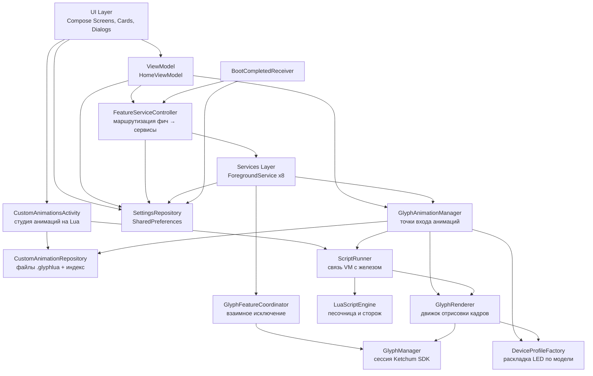

# Документация проекта Glyph Sharge (Glyph Zen)

> Полное техническое руководство для разработчиков. Актуально для версии **1.0.31** (versionCode 1031).
> Англоязычная версия: [DOCUMENTATION_EN.md](DOCUMENTATION_EN.md)

---

## Содержание

1. [Обзор проекта](#1-обзор-проекта)
2. [Требования и запуск](#2-требования-и-запуск)
3. [Архитектура](#3-архитектура)
4. [Слой Glyph](#4-слой-glyph)
5. [Слой данных](#5-слой-данных)
6. [Сервисы](#6-сервисы)
7. [**Добавление нового сервиса (Quickstart)**](#7-добавление-нового-сервиса-quickstart)
8. [Слой UI](#8-слой-ui)
9. [Навигация](#9-навигация)
10. [Музыкальная визуализация](#10-музыкальная-визуализация)
11. [Ресурсы и локализация](#11-ресурсы-и-локализация)
12. [Сборка и конфигурация](#12-сборка-и-конфигурация)
13. [Известные проблемы и подводные камни](#13-известные-проблемы-и-подводные-камни)
14. [**Пользовательские анимации (Lua)**](#14-пользовательские-анимации-lua)

---

## 1. Обзор проекта

**Glyph Sharge** — приложение для управления световой интерфейсией **Nothing Glyph** на телефонах Nothing.
Приложение даёт полный контроль над светодиодами: индикация заряда, уведомления, безопасность, персонализация.

> ⚠️ Это **не** официальный продукт Nothing Technology Limited.

### Ключевые возможности

| Область | Возможности |
|---------|-------------|
| 🔌 Питание | Анимации зарядки, отображение уровня батареи, оповещения о низком заряде, Power Peek (тряска → проверка батареи) |
| 🔒 Безопасность | Pulse Lock (анимация при разблокировке), Screen Off (анимация при блокировке) |
| 📡 Интеграция | NFC-глифы по событию оплаты |
| 🎨 Персонализация | 6 стилей тем, шрифты Nothing (NType Headline, NDot 55 Caps), масштабирование размеров текста, собственные анимации глифов на Lua |
| ⚙️ Система | Тихие часы, автозапуск после загрузки, журналирование |

### Поддерживаемые устройства

| Устройство | Модель | Статус |
|------------|--------|--------|
| Nothing Phone (1) | 20111 | Без тестировщиков |
| Nothing Phone (2) | 22111 | Без тестировщиков |
| Nothing Phone (2a) | 23111 / 23113 | Без тестировщиков |
| Nothing Phone (3a) | 24111 | ✅ Полная поддержка |

Определение модели выполняется в [DeviceType](../app/src/main/java/com/bleelblep/glyphsharge/glyph/device/DeviceType.kt)
через рефлексию `Common.is20111()` и т. д. — на неподдерживаемом устройстве приложение запускается,
но глифы работать не будут.

### Ключевые факты проекта

| Параметр | Значение |
|----------|----------|
| Package / namespace | `com.bleelblep.glyphsharge` |
| Application ID | `com.bleelblep.glyphsharge` |
| minSdk / targetSdk | **34** / 34 (Android 14+) |
| compileSdk | 36 |
| JVM target | 17 |
| Язык | Kotlin 1.9.10, Jetpack Compose (Material 3) |
| DI | Hilt 2.50 (KSP + kapt) |
| Хранилище настроек | SharedPreferences (файл `glyphzen_settings`) |
| Скрипты анимаций | LuaJ 3.0.1 (`org.luaj:luaj-jse`) — чисто-JVM Lua 5.2 |
| SDK глифов | `app/libs/KetchumSDK_Community_20250319.jar` (официальный ключ Nothing) |

> [!IMPORTANT]
> В проекте **нет debug-режима для глифов** — используется официальный API-ключ Nothing,
> прописанный в `AndroidManifest.xml` как `<meta-data android:name="NothingKey" .../>`.
> Значение `"test"` использовать не нужно.

---

## 2. Требования и запуск

### Требования

- **JDK 17** (обязательно — активный build-скрипт выставляет `sourceCompatibility 17`)
- **Android Studio** Hedgehog (2023.1.1) или новее
- **Android SDK** 36 (compile), 34 (min)
- Физический телефон Nothing для проверки глифов

### Клонирование и сборка

```bash
git clone https://github.com/hardWorker254/Glyph-Sharge-fork.git
cd Glyph-Sharge-fork
```

Открыть в Android Studio, дождаться синхронизации Gradle, затем:

```bash
# Debug-сборка и установка
./gradlew app:assembleDebug
./gradlew app:installDebug

# Только сборка
./gradlew app:assembleRelease
```

> [!WARNING]
> **Активен файл `app/build.gradle` (Groovy), а НЕ `app/build.gradle.kts`.**
> Gradle всегда предпочитает Groovy-скрипт. Это критично: в `.kts` указан другой namespace
> (`com.bleelblep.glyphzenredesign`), другие версии и включённый R8. Ориентируйтесь на Groovy-файл.

### Проверка на устройстве

Глифы физически отсутствуют на эмуляторе. Проверяйте на реальном Nothing Phone.
Для проверки UI без устройства Nothing приложение всё равно запустится —
`isNothingPhone()` вернёт `false`, карточки останутся неактивными.

---

## 3. Архитектура

Проект построен на **MVVM + Unidirectional Data Flow + Repository + Hilt DI**.



### Слои

| Слой | Пакет | Ответственность |
|------|-------|-----------------|
| **Glyph** | `glyph/` | Сессия Nothing SDK, низкоуровневая работа с каналами, все анимации, арбитраж доступа к LED. Разделён на `device/` (раскладка по модели), `engine/` (отрисовка кадров), `animations/` и `battery/` (сами эффекты), `script/` (пользовательские анимации на Lua) |
| **Data** | `data/` | Настройки пользователя, миграции, значения по умолчанию |
| **Services** | `services/` | Foreground-сервисы, реагирующие на системные события |
| **UI** | `ui/` | Compose-экраны, карточки, диалоги, темы, шрифты, навигация |
| **DI** | `di/` | `@EntryPoint` для доступа к Hilt-графу из composable-контекста |
| **Utils** | `utils/` | Логирование, водяные знаки |
| **Receiver** | `receiver/` | Восстановление сервисов после перезагрузки |

### Структура каталогов

```
app/src/main/java/com/bleelblep/glyphsharge/
├── GlyphZenApplication.kt      # @HiltAndroidApp (класс GlyphShargeApplication)
├── MainActivity.kt             # Точка входа, единственная Activity приложения
├── CustomAnimationsActivity.kt # Студия Lua-анимаций (отдельная Activity, не в NavHost)
├── glyph/
│   ├── GlyphManager.kt         # Сессия SDK, регистрация устройства
│   ├── GlyphAnimationManager.kt# Фасад: публичные точки входа анимаций
│   ├── GlyphFeatureCoordinator.kt # Mutex + enum GlyphFeature (слой glyph)
│   ├── AnimationCatalog.kt     # enum GlyphAnimationId (id из настроек)
│   ├── device/                 # Раскладка LED и тайминги по модели
│   │   ├── DeviceType.kt       # Определение модели — в одном месте
│   │   ├── DeviceProfile.kt    # Классы данных профиля
│   │   └── DeviceProfileFactory.kt
│   ├── engine/                 # Сборка кадров, флаг запуска, обработка ошибок
│   │   └── GlyphRenderer.kt
│   ├── animations/             # Сами анимации
│   │   ├── SequenceAnimations.kt
│   │   └── ParticleAnimations.kt
│   ├── script/                 # Пользовательские анимации на Lua
│   │   ├── ScriptAnimation.kt  # Модель: имя, исходник, id вида custom:<12 hex>
│   │   ├── ScriptFileFormat.kt # Контейнер .glyphlua (encode/decode/имя файла)
│   │   ├── LuaScriptEngine.kt  # LuaJ: песочница, сторож, validate()
│   │   ├── ScriptSession.kt    # Состояние прогона: дедлайн, бюджет, прерываемые паузы
│   │   ├── GlyphLuaApi.kt      # Таблица glyph — весь язык для скрипта
│   │   └── ScriptRunner.kt     # Единственное место, где VM встречается с железом
│   └── battery/                # Анимация зарядки и Power Peek
│       ├── BatteryState.kt
│       └── BatteryGlyphAnimator.kt
├── data/
│   ├── SettingsRepository.kt   # SharedPreferences
│   └── CustomAnimationRepository.kt # Файлы скриптов + индекс, экспорт через MediaStore
├── services/
│   ├── GlyphForegroundService.kt   # Мастер-сервис
│   ├── FeatureServiceController.kt # Единая точка маппинга фича → сервис
│   ├── ChargingAnimationService.kt
│   ├── PowerPeekService.kt
│   ├── PulseLockService.kt
│   ├── ScreenOffGlyphService.kt
│   ├── NfcGlyphService.kt
│   ├── LowBatteryAlertService.kt
│   └── QuietHoursService.kt
├── receiver/
│   └── BootCompletedReceiver.kt
├── ui/
│   ├── components/            # Карточки, диалоги, layout
│   │   ├── FeatureCards.kt    # 6 карточек фич
│   │   ├── GlyphAnimations.kt # Каталог анимаций + rememberAnimationOptions()
│   │   ├── cards/             # ContentCard, FeatureCard, WideFeatureCardWithToggle
│   │   ├── controls/          # MorphingToggleButton
│   │   ├── dialogs/           # FeatureDialogScaffold, FeatureConfirmationFlow
│   │   └── layout/            # SettingsScaffold, DraggableSettingsCard
│   ├── screens/               # Экраны
│   │   └── animations/       # Студия: список, редактор, превью
│   ├── navigation/            # Routes, GlyphNavHost
│   ├── state/                 # enum GlyphFeature (слой UI), HomeUiState
│   ├── theme/                 # Темы, шрифты, типографика
│   ├── utils/                 # HapticUtils
│   └── viewmodel/             # HomeViewModel, AnimationStudioViewModel
├── utils/
│   ├── LoggingManager.kt
│   └── WatermarkHelper.kt
└── di/
    ├── AppModule.kt
    └── GlyphComponent.kt      # Точка входа: GlyphAnimationManager + CustomAnimationRepository
```

### Ключевые архитектурные решения

**Единая точка маршрутизации фич.** [FeatureServiceController](../app/src/main/java/com/bleelblep/glyphsharge/services/FeatureServiceController.kt)
решает, какой сервис обслуживает какую фичу. Раньше это расписывалось в четырёх местах
(`MainActivity.initializeServices`, два обработчика переключателей, `syncServicesAfterToggle`),
и добавление фичи требовало правки всех. Сейчас объявлено один раз, и Activity и ViewModel
управляют сервисами через один и тот же объект.

**Взаимное исключение по LED.** Несколько сервисов могут одновременно захотеть включить глифы.
[GlyphFeatureCoordinator](../app/src/main/java/com/bleelblep/glyphsharge/glyph/GlyphFeatureCoordinator.kt)
держит `Mutex` — одновременно светодиодами владеет только одна фича. Второй получает отказ
за 500 мс и корректно уступает.

**Пользовательские анимации — это отдельный движок за существующим фасадом.** Скрипты на Lua
не получили ни своей ветки в сервисах, ни своего рендерера. Настройка фичи по-прежнему хранит
одну строку-id, а `GlyphAnimationManager.playAnimation(id, durationMs)` **до** встроенного
`GlyphAnimationId.of(id)` проверяет `ScriptAnimation.isCustomId(id)` и уходит в `ScriptRunner`:

```
настройка фичи (id вида custom:<12 hex>)
  → CustomAnimationRepository (поиск исходника)
  → GlyphAnimationManager.playAnimation
  → ScriptRunner.runScript          (Dispatchers.Default, RendererHost)
  → LuaScriptEngine.run             (LuaJ, песочница + сторож)
  → GlyphRenderer → GlyphManager    (светодиоды)
```

Скрипт идёт по **тому же** пути `anim { }` с теми же гашениями полосы, что и встроенная анимация,
поэтому ограничение по длительности фичи работает для него так же, как для остальных. Подробности —
[раздел 14](#14-пользовательские-анимации-lua).

**Студия — отдельная Activity, а не маршрут NavHost.** [CustomAnimationsActivity](../app/src/main/java/com/bleelblep/glyphsharge/CustomAnimationsActivity.kt)
объявлена в манифесте с `android:exported="false"` и `parentActivityName=".MainActivity"`.
У неё собственный стек возврата (`BackHandler` между списком и редактором) и собственные
`ActivityResultLauncher` для `OpenDocument`/`CreateDocument` — системные диалоги не должны
просачиваться в общий навграф настроек. Из `SettingsScreen` на неё ведёт новая карточка
`settings_card_custom_animations` со счётчиком сохранённых скриптов.

> [!CAUTION]
> **В проекте объявлены два разных enum `GlyphFeature`:**
> - `ui/state/FeatureModels.kt` — 6 значений (только реально используемые), для UI и `FeatureServiceController`
> - `glyph/GlyphFeatureCoordinator.kt` — 9 значений (включая неиспользуемые `GLYPH_GUARD`, `BATTERY_STORY`, `MANUAL_DEMO`), для арбитража LED
>
> При добавлении фичи **нужно менять оба**. См. [раздел 7](#7-добавление-нового-сервиса-quickstart).

---

## 4. Слой Glyph

### GlyphManager

`@Singleton`, инжектится через конструктор. Обёртка над официальным SDK `com.nothing.ketchum`.
Отвечает **только** за сессию SDK — ни логики анимаций, ни захардкоженных номеров каналов.

```kotlin
fun initialize()                 // инициализация SDK, ленивый mCallback, привязка к сервису
fun isNothingPhone(): Boolean    // проверка модели устройства
fun openSession()                // открыть сессию глифов
fun closeSession()               // закрыть сессию
val isSessionActive: Boolean     // состояние сессии
val isServiceConnected: Boolean  // привязан ли сервис Nothing
var onSessionStateChanged: ((Boolean) -> Unit)?  // зеркало состояния SDK в UI
fun forceEnsureSession(): Boolean// блокирующее ожидание готовности (до 2 с)
fun toggleGlyphService(): Boolean
fun turnOffAll()                 // погасить все LED
fun turnOnAllGlyphs()            // включить все каналы подключённой модели
fun canPerformOperation(): Boolean
fun cleanup()
```

**Жизненный цикл сессии:**

1. `GlyphShargeApplication.onCreate` → `if (isNothingPhone()) glyphManager.initialize()`
2. `GlyphManager.mCallback.onServiceConnected` → `DeviceType.detect()` → `mGM.register(id)`
3. `HomeViewModel.toggleGlyphService(true)` → `openSession()`
4. `GlyphFeatureCoordinator.acquire()` → если сессия не активна, `forceEnsureSession()`
5. `onStop` / `onDestroy` → при выключенной настройке `closeSession()` + `cleanup()`

**Определение модели** централизовано в `DeviceType.detect()`. Enum хранит и проверку
`Common.is*`, и id для регистрации в SDK, поэтому вопрос «какой это телефон?» задаётся ровно
в одном месте вместо пяти цепочек `when`.

> [!NOTE]
> `forceEnsureSession()` использует блокирующий `Thread.sleep(100)` в цикле до 2 секунд.
> Вызывается из `GlyphFeatureCoordinator.acquire()` через `withContext(Dispatchers.IO)`,
> то есть блокирует IO-поток на всё время ожидания, если сервис Nothing не привяжется.

### GlyphRenderer

`@Singleton`, инжектится через конструктор. **Единственный** класс, который напрямую работает
с `GlyphManager.mGM`. Анимации написаны как `suspend`-расширения на нём — благодаря этому три
общие для всех анимаций вещи живут в одном месте:

| Метод | Назначение |
|-------|------------|
| `val isRunning: Boolean` | ставится `start()` / `stop()`, проверяется в каждом цикле анимации |
| `turnOff()` | погасить полосу; никогда не бросает исключений |
| `frame(channels, brightness)` | билдер с включёнными каналами одной яркости либо `null` |
| `builder()` | пустой билдер — для ручных рамп яркости по каналам |
| `toggle(builder, delayMs)` | показать кадр и, опционально, подождать |
| `toggleChannels(channels, brightness, delayMs)` | `frame` + `toggle` |
| `pulse(channels, onMs, offMs, brightness)` | примитив «включить, выключить, подождать» |
| `onError(e, message, retryDelayMs)` | залогировать сбой и продолжить — но перебрасывает `CancellationException` |

`GLYPH_MAX_BRIGHTNESS = 4000` — верхнеуровневая константа в этом же файле.

### GlyphAnimationManager

`@Singleton`. Тонкий фасад — **все публичные точки входа — `suspend`**, и ни одна из них
ничего не рисует сама. Инжектит `GlyphManager` (проверки), `GlyphRenderer` (движок)
и `SettingsRepository` (что играть), и один раз лениво вычисляет `DeviceProfile?`
(`null` на неподдерживаемом железе).

**Базовые анимации** (все `suspend`):

| Функция | Описание |
|---------|----------|
| `runWaveAnimation()` | Волна по группам сегментов |
| `runBeedahAnimation()` | Тот же ритм без пауз между группами |
| `runSpiralAnimation()` | Спиральный проход с ростом яркости 0.6 → 1.0 |
| `runC1SequentialAnimation()` | Последовательный проход по C-полосе туда и обратно |
| `runLockPulseAnimation()` | «Замок»: расширяющийся клин 0.3 → 1.0 |
| `runPulseEffect(cycles: Int = 3)` | Мигание, 300 мс вкл/выкл |
| `runHeartbeatAnimation()` | Три удара «lub-dub» |
| `runMatrixRainAnimation()` | Падающие капли с хвостами |
| `runFireworksAnimation()` | Запуски и взрывы с затуханием |
| `runDNAHelixAnimation()` | Две встречно вращающиеся нити |

**Сценарии фич** — обёртки, которые проверяют настройки и вызывают базовую анимацию:

```kotlin
suspend fun playPulseLockAnimation()
suspend fun playLowBatteryAnimation()
suspend fun playScreenOffAnimation()
suspend fun playNfcAnimation()
suspend fun playPowerPeekAnimation(context: Context, onProgressUpdate: (Float) -> Unit = {})
suspend fun playChargingAnimationAnimation(context: Context, onProgressUpdate: (Float) -> Unit = {})
fun stopAnimations()
```

**Диспетчеризация по id.** Приватный `playAnimation(id, durationMs)` **сначала** проверяет,
не является ли id пользовательским (`ScriptAnimation.isCustomId(id)` → префикс `custom:`), и если
да — уходит в `playCustomAnimation(id, durationMs)`. Только иначе сохранённый id разбирается
через `GlyphAnimationId.of(id)` и выполняется `when` по enum:

| id | Анимация |
|----|----------|
| `C1` | `runC1SequentialAnimation()` |
| `WAVE` | `runWaveAnimation()` |
| `BEEDAH` | `runBeedahAnimation()` |
| `LOCK` | `runLockPulseAnimation()` |
| `SPIRAL` | `runSpiralAnimation()` |
| `HEARTBEAT` | `runHeartbeatAnimation()` |
| `MATRIX` | `runMatrixRainAnimation()` |
| `FIREWORKS` | `runFireworksAnimation()` |
| `DNA` | `runDNAHelixAnimation()` |
| `PULSE` + всё остальное | `runPulseEffect(cycles)` |

> [!NOTE]
> `durationMs` используется **только** в ветке `PULSE` (`cycles = duration / 500`).
> Именованные анимации идут своей естественной длиной, игнорируя настройку.
> Для пользовательского скрипта `durationMs` — наоборот, жёсткий потолок длительности прогона.

**Пользовательские анимации.** Три новых публичных метода и один изменённый:

| Метод | Назначение |
|-------|-----------|
| `suspend fun playCustomAnimation(runtimeId: String, durationMs: Long): ScriptRunResult` | Запуск сохранённого скрипта по `custom:`-id. Проверяет тумблер сервиса и `isNothingPhone()`, ищет исходник в `CustomAnimationRepository` |
| `suspend fun previewScript(source: String, durationMs: Long): ScriptRunResult` | Прогон несохранённого исходника из редактора. **Без** проверки тумблера: студия — явное действие пользователя |
| `fun checkScript(source: String): String?` | Компиляция без запуска, кнопка «Проверить». `null` — синтаксис в порядке |
| `fun stopAnimations()` | Теперь дополнительно вызывает `scriptRunner.stop()`, чтобы прервать и скрипт |

Все три идут через приватный `playScript { }`: гасит полосу, запускает блок, гасит снова в
`finally`, а любое исключение превращает в `ScriptRunResult(RUNTIME_ERROR, …)` — наружу не
вылетает ничего. Конструктор фасада теперь инжектит ещё и `CustomAnimationRepository`
с `ScriptRunner`.

**Обёртка `anim { }`.** Каждая базовая анимация выполняется внутри приватной обёртки, которая
проверяет тумблер сервиса и поддержку устройства, гасит полосу, выполняет тело и снова гасит
полосу в `finally`. Тело — это `suspend GlyphRenderer.(DeviceProfile) -> Unit`, поэтому
анимации читаются как `anim { runWaveAnimation(it) }`.

> [!TIP]
> Каталог стал enum: `GlyphAnimationId` в `glyph/AnimationCatalog.kt` владеет стоками id,
> поэтому опечатка в настройке — это заметное расхождение, а не тихий откат на pulse.

### Реализации анимаций

Весь код отрисовки вынесен из `GlyphAnimationManager` и сгруппирован по назначению:

| Файл | Содержимое |
|------|------------|
| `glyph/animations/SequenceAnimations.kt` | волна, beedah, pulse, heartbeat, C1, lock, spiral |
| `glyph/animations/ParticleAnimations.kt` | matrix rain, fireworks, DNA helix |
| `glyph/battery/BatteryGlyphAnimator.kt` | полоса заряда для зарядки и Power Peek плюс акценты |
| `glyph/battery/BatteryState.kt` | `BatteryState` + `BatteryStateReader` (sticky broadcast) |
| `glyph/engine/GlyphRenderer.kt` | сборка кадров, флаг запуска, обработка ошибок, `pulse` |
| `glyph/device/DeviceProfileFactory.kt` | раскладка каналов и тайминги по моделям |
| `glyph/device/DeviceType.kt` | единственный источник правды об определении модели |
| `glyph/device/DeviceProfile.kt` | `DeviceProfile`, `AnimGroup` и три конфига таймингов |
| `glyph/script/LuaScriptEngine.kt` | LuaJ-песочница, сторож, `validate()` |
| `glyph/script/GlyphLuaApi.kt` | Таблица `glyph` — весь пользовательский язык |
| `glyph/script/ScriptRunner.kt` | Единственное место, где VM соединяется с `GlyphRenderer` |

Два соглашения делают анимации читаемыми:

- каждый цикл начинается с `if (!isRunning) return` — именно это позволяет `stopAnimations()`
  сработать за один шаг, а не в конце пятисекундной последовательности;
- если кадр построить не удалось, используется `builder() ?: break`, а не исключение,
  поэтому последовательность деградирует до тех кадров, которые отрисовать удалось.

Каталог анимаций для UI — объект `GlyphAnimations` в
[ui/components/GlyphAnimations.kt](../app/src/main/java/com/bleelblep/glyphsharge/ui/components/GlyphAnimations.kt):
10 записей `GlyphAnim(id, displayName, iconRes, isCustom = false)` и `getById(id, options)`
с откатом на первую запись. `withCustomAnimations(custom)` дописывает скрипты пользователя
**после** встроенных, поэтому ряд чипов сохраняет стабильную разметку. Composable
`rememberAnimationOptions()` читает репозиторий через `GlyphComponent` (диалоги фич — обычные
composable, а не ViewModel) и возвращает список, подписанный на `StateFlow`. Его используют
`PulseLock`, `LowBattery`, `NfcGlyph` и `ScreenOff`: у каждого в Test-кнопке появилась ветка
`if (selectedAnimation.isCustom) playCustomAnimation(id, duration)`.

### GlyphFeatureCoordinator

```kotlin
val currentOwner: StateFlow<GlyphFeature?>
suspend fun acquire(owner: GlyphFeature, timeoutMs: Long = 500L): Boolean
fun release(owner: GlyphFeature)
```

`acquire()` захватывает `Mutex` с таймаутом, при успехе выставляет `_currentOwner`,
и при необходимости поднимает сессию глифов. `release()` сначала гасит LED
(`turnOffAll()`), и только потом отдаёт mutex следующему владельцу — вызов от
не-владельца игнорируется.

---

## 5. Слой данных

### SettingsRepository

`@Singleton`, инжектится через конструктор с `@ApplicationContext`. Хранилище —
**SharedPreferences**, файл `glyphzen_settings`. Никаких `Flow`/`StateFlow` — все геттеры
синхронные, экраны опрашивают состояние через `remember` + `refreshFeatures()` в `onResume`.

**Блок `init`** выполняет три задачи при первом создании:

1. `applyFirstRunDefaults()` — под флагом `first_run_completed` записывает `false` для всех
   фич, `HEADLINE` для шрифта, `use_custom_fonts = true`, масштабы `1.0f`.
2. `applyVersionMigrations()` — четыре шага (`< 109`, `< 110`, `< 111`, `< 112`), каждый
   проверяет `prefs.contains(KEY)` перед записью, чтобы потеря маркера версии не сбросила
   пользовательские переключатели.
3. `normalizeLegacyVibrationIntensity()` — переводит старое значение вибрации `1..255`
   в шкалу `0.1f..1.0f`.

Именно поэтому `GlyphShargeApplication.onCreate` прикасается к репозиторию **раньше всего** —
это гарантирует запись defaults до чтения любым компонентом.

**Публичный API (сгруппированно):**

| Группа | Методы |
|--------|--------|
| Тема | `saveTheme` / `getTheme`, `saveThemeStyle` / `getThemeStyle` |
| Шрифт | `saveFontVariant` / `getFontVariant`, `saveUseCustomFonts` / `getUseCustomFonts`, `saveFontSizeSettings` / `getFontSizeSettings`, `clearFontSizeCustomization`, `getFontSizeSettingsForFont` |
| Мастер-переключатель | `saveGlyphServiceEnabled` / `getGlyphServiceEnabled` |
| Power Peek | `savePowerPeekEnabled` / `isPowerPeekEnabled`, `savePowerPeekThreshold` / `getPowerPeekThreshold`, `getShakeIntensityLevel`, `savePowerPeekDuration` / `getPowerPeekDuration`, `saveVibrationIntensity` / `getVibrationIntensity` |
| Pulse Lock | `savePulseLockEnabled` / `isPulseLockEnabled`, `…AnimationId`, `…Duration` |
| Low Battery | `saveLowBatteryEnabled` / `isLowBatteryEnabled`, `…Threshold`, `…AnimationId`, `…Duration` |
| Screen Off | `saveScreenOffFeatureEnabled` / `isScreenOffFeatureEnabled`, `…AnimationId`, `…Duration` |
| NFC | `saveNfcFeatureEnabled` / `isNfcFeatureEnabled`, `…AnimationId`, `…AnimationDuration` |
| Charging | `saveChargingAnimationEnabled` / `isChargingAnimationEnabled`, `…Duration` |
| Тихие часы | `saveQuietHoursEnabled` / `isQuietHoursEnabled`, `saveQuietHoursStartHour/Minute`, `saveQuietHoursEndHour/Minute`, `isCurrentlyInQuietHours()` |
| Язык | `getAppLanguageCode` / `saveAppLanguageCode` |
| Отладка | `dumpAllSettings()` (пишет в Logcat только при `Log.isLoggable`) |

Публичные константы: `SHAKE_SOFT=12.0f`, `SHAKE_EASY=15.0f`, `SHAKE_MEDIUM=18.0f`,
`SHAKE_HARD=22.0f`, `SHAKE_HARDEST=28.0f`.

> [!NOTE]
> У анимации зарядки **нет** настройки выбора анимации (`saveChargingAnimationId` отсутствует) —
> используется фиксированный `playChargingAnimationAnimation`.

### CustomAnimationRepository

`@Singleton`, второй репозиторий слоя данных — на пользовательские анимации.
[CustomAnimationRepository.kt](../app/src/main/java/com/bleelblep/glyphsharge/data/CustomAnimationRepository.kt)

**Исходники в файлах, индекс в настройках.** Скрипт редактируют часто, и он бывает
длиннее, чем стоит хранить в значении настройки, поэтому каждый лежит отдельным файлом
`filesDir/glyph_scripts/<id>.glyphlua`, а SharedPreferences `glyphsharge_custom_animations`
содержит только компактный JSON-массив (`org.json`) для отрисовки списка без похода на диск.

Список отдаётся как `StateFlow<List<ScriptAnimation>>` — пикеры анимаций на карточках
Pulse Lock, Low Battery, NFC и Screen Off находятся на несколько экранов от редактора,
и сохранение скрипта должно обновить чипы сразу везде.

| Группа | Методы |
|--------|--------|
| Чтение | `reload()`, `getById(id)`, `findByRuntimeId(runtimeId)`, `animations: StateFlow` |
| Запись | `draft(template)`, `save(animation)`, `rename(id, name)`, `delete(id)`, `duplicate(id)` |
| Импорт | `suspend readText(uri)`, `suspend importFrom(text, fallbackName)` |
| Экспорт | `suspend exportTo(uri, animation)` (системный выбор файла), `suspend exportToDownloads(animation)` (MediaStore) |

> [!IMPORTANT]
> **Импорт всегда назначает новый id** (`ScriptAnimation.newId()`), даже если в заголовке
> файла есть чужой. Иначе импорт файла, который уже лежит на телефоне, молча затёр бы
> локальную копию. Имена дедуплицируются суффиксом `(2)`, `(3)`… — два одинаковых названия
> в ряду чипов неразличимы.
>
> `exportToDownloads()` идёт через `MediaStore.Downloads` с протоколом `IS_PENDING`
> (API 29+), поэтому **разрешения не требуется**; `exportTo(uri)` работает через
> `ActivityResultContracts.CreateDocument`.

`STARTER_SCRIPT` — шаблон, с которого начинается новая анимация. Он намеренно использует
только `glyph.ch.all`/`glyph.ch.c` и никогда не хардкодит номер канала, поэтому работает
на любом поддерживаемом телефоне.

---

## 6. Сервисы

### Обзор

| Сервис | Назначение | Триггер |
|--------|-----------|---------|
| `GlyphForegroundService` | Постоянное уведомление, держит процесс живым. Не содержит LED-логики | `FeatureServiceController.stopAll()` |
| `ChargingAnimationService` | Анимация при подключении/отключении зарядки | `POWER_CONNECTED` / `POWER_DISCONNECTED` |
| `PowerPeekService` | Проверка батареи встряхиванием при выключенном экране | Акселерометр |
| `PulseLockService` | Анимация при разблокировке | `ACTION_USER_PRESENT` |
| `ScreenOffGlyphService` | Анимация при блокировке экрана | `ACTION_SCREEN_OFF` |
| `NfcGlyphService` | Анимация по NFC-событию | NFC-Intent через Activity |
| `LowBatteryAlertService` | Оповещение о низком заряде | `ACTION_BATTERY_CHANGED` |
| `QuietHoursService` | Тишина в заданный интервал | `AlarmManager` |
| `MusicVisualizerService` | Спектр того, что сейчас играет | `Visualizer` + `AudioManager` |

### Контракт жизненного цикла сервиса

Каждый фичевый сервис обязан реализовать **все шесть** точек:

```kotlin
@AndroidEntryPoint
class MyService : Service() {

    @Inject lateinit var settingsRepository: SettingsRepository
    @Inject lateinit var glyphAnimationManager: GlyphAnimationManager
    @Inject lateinit var featureCoordinator: GlyphFeatureCoordinator

    // 1. Константы действий
    companion object {
        const val ACTION_START = "com.bleelblep.glyphsharge.MY_FEATURE_START"
        const val ACTION_STOP  = "com.bleelblep.glyphsharge.MY_FEATURE_STOP"
        private const val TAG = "MyService"
        private const val NOTIF_ID = 1020
        private const val NOTIF_CHANNEL_ID = "MyServiceChannel"
    }

    // 2. Создание: канал уведомлений, WakeLock, ресиверы
    override fun onCreate() {
        super.onCreate()
        createNotificationChannel()
        registerReceivers()
    }

    // 3. Запуск: обязательно startForeground() в первых строках
    override fun onStartCommand(intent: Intent?, flags: Int, startId: Int): Int {
        startForeground(NOTIF_ID, buildNotification())
        if (intent?.action == ACTION_STOP) { shutDown(); return START_NOT_STICKY }
        if (!settingsRepository.getGlyphServiceEnabled() || !settingsRepository.isMyFeatureEnabled()) {
            shutDown(); return START_NOT_STICKY
        }
        return START_STICKY
    }

    // 4. Уничтожение: снять ресиверы, отпустить WakeLock, отменить корутины
    override fun onDestroy() {
        runCatching { unregisterReceiver(myReceiver) }
        runCatching { wakeLock?.takeIf { it.isHeld }?.release() }
        serviceJob.cancel()
        super.onDestroy()
    }

    // 5. Сервис не биндится
    override fun onBind(intent: Intent?): IBinder? = null

    // 6. Самовосстановление после снятия из недавних
    override fun onTaskRemoved(rootIntent: Intent?) {
        super.onTaskRemoved(rootIntent)
        if (!settingsRepository.getGlyphServiceEnabled()) return
        startForegroundService(Intent(this, MyService::class.java).apply { action = ACTION_START })
    }
}
```

### Правила, которые нельзя нарушать

> [!IMPORTANT]
> 1. **`startForeground()` в начале `onStartCommand`** — иначе на Android 12+ система
>    выбросит `ForegroundServiceDidNotStartInTimeException`.
> 2. **Все 8 сервисов используют `foregroundServiceType="specialUse"`** и обязаны объявлять
>    свой `android.app.PROPERTY_SPECIAL_USE_FGS_SUBTYPE` в манифесте — это требование Google Play.
> 3. **Все проверки в три слоя**: главный переключатель `getGlyphServiceEnabled()`,
>    собственный флаг фичи, и тихие часы `isCurrentlyInQuietHours()`.
> 4. **Всегда `runCatching { release() }`** для WakeLock и `unregisterReceiver` — они бросают
>    исключения, если ресурс не был захвачен.
> 5. **Обязательно `featureCoordinator.release()` в блоке `finally`** — иначе mutex
>    останется захваченным и все остальные фичи замрут.
> 6. **Watchdog-корутина** ограничивает анимацию настройкой длительности, даже если сама
>    анимация идёт дольше.

### Канонический шаблон запуска анимации

```kotlin
private fun triggerMyFeature() {
    animationScope.launch {
        if (!settingsRepository.getGlyphServiceEnabled()) return@launch
        if (settingsRepository.isCurrentlyInQuietHours()) return@launch
        if (!settingsRepository.isMyFeatureEnabled()) return@launch
        if (!featureCoordinator.acquire(GlyphFeature.MY_FEATURE)) return@launch

        val duration = settingsRepository.getMyFeatureDuration()
        runCatching { wakeLock.acquire(duration + 1000L) }

        try {
            val animJob = launch(Dispatchers.Default) {
                glyphAnimationManager.playMyFeatureAnimation()
            }
            val watchdogJob = launch {
                delay(duration.milliseconds)
                animJob.cancelAndJoin()
                glyphAnimationManager.stopAnimations()
            }
            animJob.join()
            watchdogJob.cancel()
        } catch (e: Exception) {
            Log.e(TAG, "Error in my feature sequence", e)
        } finally {
            featureCoordinator.release(GlyphFeature.MY_FEATURE)
            runCatching { if (wakeLock.isHeld) wakeLock.release() }
        }
    }
}
```

### FeatureServiceController

Единственная точка, где описана связь «фича → сервис → настройка». Четыре `when`-выражения
**исчерпывающие** (без `else`), поэтому добавление нового значения в enum компилятор
подсвечивает автоматически:

```kotlin
private fun serviceOf(feature: GlyphFeature): Class<out Service> = when (feature) { ... }
private fun stopActionOf(feature: GlyphFeature): String          = when (feature) { ... }
fun isEnabled(feature: GlyphFeature): Boolean                   = when (feature) { ... }
fun saveEnabled(feature: GlyphFeature, enabled: Boolean)         { when (feature) { ... } }
```

Публичный API: `readAll()`, `start(feature)`, `stop(feature)`, `apply(feature, enabled)`,
`startAllEnabled()`, `stopAll()`.

`startAllEnabled()` и `stopAll()` итерируют `GlyphFeature.entries`, поэтому новая фича
подхватывается автоматически — отдельно регистрировать её не нужно.

### BootCompletedReceiver

`@AndroidEntryPoint`, работает через `goAsync()` + `Dispatchers.IO`. Восстановление в два
уровня с задержкой `TIER2_DELAY_MS = 100L`:

1. **Уровень 1** — `GlyphForegroundService`, если включён мастер-переключатель.
2. **Уровень 2** — шесть фич по порядку: PowerPeek, LowBattery, PulseLock, ScreenOff, NFC,
   Charging Animation. Каждая — под своим флагом **и** под общим `glyphOn`.
3. **Тихие часы** — в конце, не зависит от глифов.

---

## 7. Добавление нового сервиса (Quickstart)

> [!TIP]
> Это пошаговая инструкция: **как добавить новую фичу со своим foreground-сервисом**,
> аналогично `PowerPeekService` / `LowBatteryAlertService`.
> Пример: фича «Счётчик шагов» (`StepCounter`).

Порядок выбран **снизу вверх** (данные → ядро → сервис → манифест → UI), чтобы в любой
момент проект компилировался либо падал с понятной ошибкой компилятора.

### Сводная карта изменений

| # | Шаг | Файл |
|---|-----|------|
| 1 | Ключ и методы настроек | [SettingsRepository.kt](../app/src/main/java/com/bleelblep/glyphsharge/data/SettingsRepository.kt) |
| 2 | Значение в enum (UI) | [FeatureModels.kt](../app/src/main/java/com/bleelblep/glyphsharge/ui/state/FeatureModels.kt) |
| 3 | Значение в enum (glyph) | [GlyphFeatureCoordinator.kt](../app/src/main/java/com/bleelblep/glyphsharge/glyph/GlyphFeatureCoordinator.kt) |
| 4 | Функция воспроизведения | [GlyphAnimationManager.kt](../app/src/main/java/com/bleelblep/glyphsharge/glyph/GlyphAnimationManager.kt) |
| 5 | Сам сервис | **новый** `services/StepCounterService.kt` |
| 6 | Маршрутизация | [FeatureServiceController.kt](../app/src/main/java/com/bleelblep/glyphsharge/services/FeatureServiceController.kt) |
| 7 | Объявление в манифесте | [AndroidManifest.xml](../../app/src/main/AndroidManifest.xml) |
| 8 | Строки | `res/values/strings.xml` + `res/values-ru-rRU/strings.xml` |
| 9 | Диалоги настройки | **новый** `ui/components/StepCounter.kt` |
| 10 | Карточка | [FeatureCards.kt](../app/src/main/java/com/bleelblep/glyphsharge/ui/components/FeatureCards.kt) |
| 11 | Вывод на главный экран | [HomeFeatures.kt](../app/src/main/java/com/bleelblep/glyphsharge/ui/screens/home/HomeFeatures.kt) |
| 12 | Тестовая кнопка | [HomeViewModel.kt](../app/src/main/java/com/bleelblep/glyphsharge/ui/viewmodel/HomeViewModel.kt) |
| 13 | Восстановление после загрузки | [BootCompletedReceiver.kt](../app/src/main/java/com/bleelblep/glyphsharge/receiver/BootCompletedReceiver.kt) |

---

### Шаг 1. Настройки в `SettingsRepository`

Добавьте ключ в `companion object`:

```kotlin
private const val KEY_STEP_COUNTER_ENABLED = "step_counter_enabled"
private const val KEY_STEP_COUNTER_DURATION = "step_counter_duration"
```

Добавьте методы (рядом с аналогичными методами других фич):

```kotlin
fun saveStepCounterEnabled(enabled: Boolean) =
    prefs.edit { putBoolean(KEY_STEP_COUNTER_ENABLED, enabled) }

fun isStepCounterEnabled(): Boolean =
    prefs.getBoolean(KEY_STEP_COUNTER_ENABLED, false)

fun saveStepCounterDuration(durationMs: Long) =
    prefs.edit { putLong(KEY_STEP_COUNTER_DURATION, durationMs) }

fun getStepCounterDuration(): Long =
    prefs.getLong(KEY_STEP_COUNTER_DURATION, 3000L)
```

И добавьте значение по умолчанию в `applyVersionMigrations()` — новый шаг `< 113`:

```kotlin
if (lastVersion < 113) {
    if (!prefs.contains(KEY_STEP_COUNTER_ENABLED)) {
        prefs.edit { putBoolean(KEY_STEP_COUNTER_ENABLED, false) }
    }
    prefs.edit { putInt(KEY_LAST_MIGRATED_VERSION, 113) }
}
```

> [!TIP]
> Проверка `prefs.contains(...)` обязательна — без неё у пользователя, у которого фича
> уже включена, миграция сбросит настройку при обновлении.

---

### Шаг 2. Enum `GlyphFeature` (слой UI)

В [FeatureModels.kt](../app/src/main/java/com/bleelblep/glyphsharge/ui/state/FeatureModels.kt:15):

```kotlin
enum class GlyphFeature {
    CHARGING_ANIMATION,
    POWER_PEEK,
    PULSE_LOCK,
    SCREEN_OFF,
    NFC,
    LOW_BATTERY,
    STEP_COUNTER          // ← новое
}
```

---

### Шаг 3. Enum `GlyphFeature` (слой glyph)

В [GlyphFeatureCoordinator.kt](../app/src/main/java/com/bleelblep/glyphsharge/glyph/GlyphFeatureCoordinator.kt:61)
добавьте **то же самое имя** во второй enum:

```kotlin
enum class GlyphFeature {
    PULSE_LOCK,
    POWER_PEEK,
    GLYPH_GUARD,
    BATTERY_STORY,
    MANUAL_DEMO,
    LOW_BATTERY,
    SCREEN_OFF,
    NFC,
    CHARGING_ANIMATION,
    STEP_COUNTER          // ← новое
}
```

> [!CAUTION]
> Эти два enum — **разные типы** с одинаковым именем. Импортируйте нужный явно.
> `FeatureServiceController` и ViewModel используют enum из `ui.state`,
> а сервисы работают с enum из `glyph`.

---

### Шаг 4. Функция воспроизведения в `GlyphAnimationManager`

Добавьте сценарий по образцу существующих:

```kotlin
suspend fun playStepCounterAnimation() {
    if (!settingsRepository.getGlyphServiceEnabled()) return
    playAnimation(
        settingsRepository.getStepCounterAnimationId(),
        settingsRepository.getStepCounterDuration()
    )
}
```

Если нужна **новая анимация**, а не существующая:

1. Реализуйте её как `suspend`-расширение на `GlyphRenderer` в нужном файле —
   `glyph/animations/SequenceAnimations.kt` для фиксированной последовательности,
   `glyph/animations/ParticleAnimations.kt` для рандомизированной. Используйте `frame()`,
   `toggle()` или `pulse()` и проверяйте `isRunning` внутри каждого цикла.
2. Добавьте в `GlyphAnimationManager` однострочник
   `suspend fun runMyAnimation() = anim { runMyAnimationImpl(it) }`.
3. Добавьте id в `GlyphAnimationId` и в `GlyphAnimations.list`, затем ветку в
   `playAnimation(id, durationMs)`.
4. (Опционально) заведите настройку `…AnimationId` в `SettingsRepository`.

---

### Шаг 5. Создайте сервис

Создайте [services/StepCounterService.kt](../app/src/main/java/com/bleelblep/glyphsharge/services/StepCounterService.kt)
по шаблону из [раздела 6](#контракт-жизненного-цикла-сервиса).
Ключевые моменты:

- `@AndroidEntryPoint` для инъекции
- `ACTION_START` / `ACTION_STOP` в `companion object` с префиксом `com.bleelblep.glyphsharge.`
- `startForeground()` первой строкой в `onStartCommand`
- `CoroutineScope(Dispatchers.Main + SupervisorJob())`
- Регистрация `BroadcastReceiver` через `ContextCompat.registerReceiver(...)`
- `featureCoordinator.release(...)` в `finally`

---

### Шаг 6. Зарегистрируйте фичу в `FeatureServiceController`

Откройте [FeatureServiceController.kt](../app/src/main/java/com/bleelblep/glyphsharge/services/FeatureServiceController.kt)
и добавьте по одной строке в **каждый** из четырёх `when`:

```kotlin
// 1) какому сервису соответствует фича
private fun serviceOf(feature: GlyphFeature): Class<out Service> = when (feature) {
    // ...
    GlyphFeature.STEP_COUNTER -> StepCounterService::class.java
}

// 2) какое действие останавливает сервис
private fun stopActionOf(feature: GlyphFeature): String = when (feature) {
    // ...
    GlyphFeature.STEP_COUNTER -> StepCounterService.ACTION_STOP
}

// 3) как прочитать настройку
fun isEnabled(feature: GlyphFeature): Boolean = when (feature) {
    // ...
    GlyphFeature.STEP_COUNTER -> settingsRepository.isStepCounterEnabled()
}

// 4) как записать настройку
fun saveEnabled(feature: GlyphFeature, enabled: Boolean) {
    when (feature) {
        // ...
        GlyphFeature.STEP_COUNTER -> settingsRepository.saveStepCounterEnabled(enabled)
    }
}
```

> [!NOTE]
> **Эти `when` исчерпывающие — без `else`.** Как только вы добавили значение в enum
> (шаг 2) и запустили сборку, компилятор сам укажет на все четыре места.
> `startAllEnabled()`, `stopAll()` и `readAll()` обновлять **не нужно** —
> они итерируют `GlyphFeature.entries` автоматически.

---

### Шаг 7. Объявите сервис в манифесте

В [AndroidManifest.xml](../../app/src/main/AndroidManifest.xml), рядом с остальными сервисами:

```xml
<!-- Step counter foreground service -->
<service
    android:name=".services.StepCounterService"
    android:enabled="true"
    android:exported="false"
    android:foregroundServiceType="specialUse">
    <property
        android:name="android.app.PROPERTY_SPECIAL_USE_FGS_SUBTYPE"
        android:value="This service displays step count progress on the glyph interface." />
</service>
```

> [!IMPORTANT]
> Описание в `PROPERTY_SPECIAL_USE_FGS_SUBTYPE` должно **точно** соответствовать назначению
> сервиса. Google Play отклоняет публикации с недостоверными формулировками —
> в текущем коде у трёх сервисов скопирован текст про «низкий заряд батареи».

Не забудьте `<uses-permission>`, если сервису нужен датчик шагомов или другая возможность:

```xml
<uses-permission android:name="android.permission.ACTIVITY_RECOGNITION" />
```

---

### Шаг 8. Добавьте строки

Скопируйте существующий блок, например `charging_animation_*` в
[values/strings.xml](../../app/src/main/res/values/strings.xml):

```xml
<string name="step_counter_title">Step Counter</string>
<string name="step_counter_description">Show today\'s steps on the glyphs</string>
<string name="step_counter_toast">Please enable the Glyph service first</string>
<string name="step_counter_how_it_works_title">How it works:</string>
<string name="step_counter_how_it_works_description">• Reads the daily step count\n• Fills the C strip proportionally</string>
<string name="step_counter_button_test">Test</string>
<string name="step_counter_configure_title">Configure</string>
<string name="step_counter_configure_subtitle">Customize step display</string>
<string name="step_counter_duration_title">Duration</string>
<string name="step_counter_duration_min">2s</string>
<string name="step_counter_duration_max">10s</string>
<string name="step_counter_button_enable">Enable</string>
```

И **те же ключи** в `res/values-ru-rRU/strings.xml` с переводом.

> [!TIP]
> В проекте покрытие локализации полное — 191 строка в `values/` и 191 в `values-ru-rRU/`.
> Сохраняйте паритет, иначе русский интерфейс покажет английский текст.

---

### Шаг 9. Диалоги настройки

Создайте [ui/components/StepCounter.kt](../app/src/main/java/com/bleelblep/glyphsharge/ui/components/StepCounter.kt)
по образцу [ChargingAnimation.kt](../app/src/main/java/com/bleelblep/glyphsharge/ui/components/ChargingAnimation.kt).
Три элемента:

```kotlin
// 1) Модель конфигурации
data class StepCounterConfig(
    val isEnabled: Boolean = false,
    val displayDuration: Long = 3000L
)

// 2) Диалог подтверждения
@Composable
fun StepCounterConfirmationDialog(
    onTest: () -> Unit,
    onEnable: () -> Unit,
    onDisable: () -> Unit,
    onDismiss: () -> Unit,
    settingsRepository: SettingsRepository,
    modifier: Modifier = Modifier
) {
    // Используйте FeatureConfirmationFlow:
    //   title, subtitle, howItWorksTitle, howItWorksDescription,
    //   testLabel, onTest, onEnable, onDisable, onDismiss, settings = { ... }
}

// 3) Диалог конфигурации
@Composable
fun StepCounterEnableDialog(
    onConfirm: (StepCounterConfig) -> Unit,
    onDisable: () -> Unit,
    onDismiss: () -> Unit,
    modifier: Modifier = Modifier,
    settingsRepository: SettingsRepository
) {
    // 1) Прочитать текущие значения в remember
    // 2) Слайдеры меняют локальное состояние
    // 3) FeatureSaveButtons(isSaving, isCurrentlyEnabled, ...) внизу
}
```

**Рецепт диалога конфигурации** (одинаков для всех шести фич):

1. Прочитать значения **один раз** в `remember` (или `rememberFloatStateOf` для слайдеров).
2. Изменения писать в репозиторий сразу **или** только по кнопке Save — в проекте
   преобладает первый вариант для выбора анимации, второй — для слайдеров.
3. Тело: прокручиваемый `Column` (`heightIn(max = 400.dp)`, `spacedBy(20.dp)`) из
   `Card` с `themeCardContainerColor()`, слайдеры через `themePrimaryActionColor()`,
   значение через `ThemedValueBadge`.
4. Каждое движение слайдера — `HapticUtils.triggerLightFeedback`.
5. Кнопки — `FeatureSaveButtons`.

**Превью анимации** из composable-контекста получайте через Hilt EntryPoint:

```kotlin
val context = LocalContext.current
val scope = rememberCoroutineScope()

scope.launch {
    val manager = EntryPointAccessors
        .fromApplication(context.applicationContext, GlyphComponent::class.java)
        .glyphAnimationManager()
    runCatching { manager.playStepCounterAnimation() }
}
```

---

### Шаг 10. Карточка фичи

Добавьте карточку в [FeatureCards.kt](../app/src/main/java/com/bleelblep/glyphsharge/ui/components/FeatureCards.kt)
по образцу `ChargingAnimationCard` — сигнатура у всех шести одинаковая:

```kotlin
@Composable
fun StepCounterCard(
    isEnabled: Boolean,
    isServiceActive: Boolean,
    onEnabledChange: (Boolean) -> Unit,
    onTest: () -> Unit,
    settingsRepository: SettingsRepository,
    modifier: Modifier = Modifier,
    title: String = stringResource(R.string.step_counter_title),
    description: String = stringResource(R.string.step_counter_description),
    icon: Painter = painterResource(R.drawable._44),
    iconSize: Int = 32
) {
    var dialogVisible by remember { mutableStateOf(false) }

    WideFeatureCardWithToggle(
        title = title,
        description = description,
        icon = icon,
        isServiceActive = isServiceActive,
        isFeatureEnabled = isEnabled,
        onFeatureToggle = onEnabledChange,
        onCardClick = {
            if (isServiceActive) dialogVisible = true
            else Toast.makeText(/* context */, R.string.step_counter_toast, Toast.LENGTH_SHORT).show()
        },
        modifier = modifier.fillMaxWidth()
    )

    if (dialogVisible) {
        StepCounterConfirmationDialog(/* … */)
    }
}
```

---

### Шаг 11. Вывод на главный экран

В [HomeFeatures.kt](../app/src/main/java/com/bleelblep/glyphsharge/ui/screens/home/HomeFeatures.kt:44)
добавьте `item {}` в конец списка:

```kotlin
item {
    StepCounterCard(
        isEnabled = uiState.stateOf(GlyphFeature.STEP_COUNTER).isEnabled,
        isServiceActive = uiState.glyphServiceEnabled,
        onEnabledChange = { viewModel.setFeatureEnabled(GlyphFeature.STEP_COUNTER, it) },
        onTest = { viewModel.testFeature(GlyphFeature.STEP_COUNTER) },
        settingsRepository = settingsRepository,
        modifier = Modifier.fillMaxWidth(),
        icon = Icons.Default.DirectionsWalk
    )
}
```

> [!NOTE]
> Порядок карточек на экране задаётся именно здесь — это единственное место, где
> перечисляются элементы списка.

---

### Шаг 12. Тестовая кнопка в `HomeViewModel`

В [HomeViewModel.kt](../app/src/main/java/com/bleelblep/glyphsharge/ui/viewmodel/HomeViewModel.kt)
добавьте ветку в `testFeature()`:

```kotlin
fun testFeature(feature: GlyphFeature) {
    emit(TOAST_BY_FEATURE[feature] ?: "Testing ${feature.name}")
    viewModelScope.launch {
        when (feature) {
            // существующие…
            GlyphFeature.STEP_COUNTER -> glyphAnimationManager.playStepCounterAnimation()
        }
    }
}
```

И сообщение в `TOAST_BY_FEATURE`:

```kotlin
GlyphFeature.STEP_COUNTER to "Testing Step Counter",
```

> [!CAUTION]
> `when` в `testFeature()` тоже исчерпывающий — компилятор подскажет.
> И заодно поправьте существующую опечатку: `LOW_BATTERY` сейчас показывает
> «Testing Power Peek».

---

### Шаг 13. Восстановление после загрузки (опционально)

В [BootCompletedReceiver.kt](../app/src/main/java/com/bleelblep/glyphsharge/receiver/BootCompletedReceiver.kt)
в функции `startServicesInOrder` в блоке второго уровня:

```kotlin
if (settingsRepository.getGlyphServiceEnabled() && settingsRepository.isStepCounterEnabled()) {
    startForegroundServiceCompat(StepCounterService::class.java) {
        action = StepCounterService.ACTION_START
    }
}
```

---

### Чек-лист перед сборкой

- [ ] Значение добавлено в **оба** enum `GlyphFeature`
- [ ] Все четыре `when` в `FeatureServiceController` дополнены
- [ ] `when` в `HomeViewModel.testFeature()` дополнен
- [ ] Сервис объявлен в манифесте с `specialUse` и `PROPERTY_SPECIAL_USE_FGS_SUBTYPE`
- [ ] Ключи настроек добавлены, миграция версии добавлена
- [ ] Строки добавлены в **обоих** `strings.xml`
- [ ] `featureCoordinator.release()` в блоке `finally` внутри сервиса
- [ ] `startForeground()` в начале `onStartCommand`
- [ ] `runCatching` вокруг `wakeLock.release()` и `unregisterReceiver`

### Частые ошибки

| Симптом | Причина |
|---------|---------|
| `ClassCastException` / не находит enum | Импортирован не тот `GlyphFeature` (из `ui.state` вместо `glyph`) |
| `ForegroundServiceDidNotStartInTimeException` | `startForeground()` не вызван в первых строках `onStartCommand` |
| Фича включается, но глифы не горят | Не вызван `featureCoordinator.release()` в `finally` — mutex залип |
| Тост вместо открытия диалога | Переключатель «Glyph service» выключен — проверьте `isServiceActive` |
| Сервис не стартует после загрузки | Не добавлен в `BootCompletedReceiver` либо флаг фичи `false` |
| Локализованный текст пустой | Ключ добавлен только в один из `strings.xml` |

---

## 8. Слой UI

### Темы

```kotlin
enum class AppThemeStyle { CLASSIC, Y2K, NEON, AMOLED, PASTEL, EXPRESSIVE }
```

- `CLASSIC` — стандартный Material 3
- `Y2K` — хром, киберпанк
- `NEON` — электрические контрастные цвета
- `AMOLED` — истинный чёрный, минимализм
- `PASTEL` — мягкие цвета
- `EXPRESSIVE` — Material 3 Expressive (асимметричные формы, `CutCornerShape`)

Хранится в `ThemeState` (`@Singleton`) как `mutableStateOf`, персистится в
`SettingsRepository.saveThemeStyle` под ключом `theme_style`. При ошибке чтения — `CLASSIC`.

**Корневой composable:**

```kotlin
@Composable
fun GlyphZenTheme(
    themeState: ThemeState,
    fontState: FontState,
    dynamicColor: Boolean = false,
    content: @Composable () -> Unit
)
```

Публикует `LocalFontState` и `LocalThemeState` (оба `staticCompositionLocalOf`).
Вызывается **только** из `MainActivity.setupUI()`.

**Цветовые схемы:** 12 схем в `ColorSchemes.kt` (тёмная и светлая для каждого стиля).
`getColorScheme(themeStyle, isDark)` — исчерпывающий `when` **без `else`**,
поэтому новое значение в enum сломает компиляцию до того, как вы забудёте про схему.

**Цвета-резолверы** в `ThemeColors.kt` (читают `LocalThemeState`):
`themeCardContainerColor()`, `themePrimaryActionColor()`, `themeSettingsButtonColor()`,
`themeSecondaryButtonColors()`.

> [!NOTE]
> Параметр `dynamicColor` нигде не передаётся `true` — Material You динамические цвета
> фактически отключены, используются только собственные схемы.

### Шрифты

```kotlin
enum class FontVariant { HEADLINE, NDOT, SYSTEM }
enum class FontCategory { DISPLAY, TITLE, BODY, LABEL }
data class FontSizeSettings(displayScale, titleScale, bodyScale, labelScale)
```

- `HEADLINE` → `R.font.ntype_82_headline` (NType Headline)
- `NDOT` → `R.font.ndot55caps` (NDot 55 Caps)
- `SYSTEM` → `FontFamily.Default`

`FontState` (`@Singleton`) держит `currentVariant`, `useCustomFonts`, `fontSizeSettings`
и выдаёт `getTitleFont()` / `getBodyFont()`. Масштабирование применяется в
`createTypography(...)` — каждый из 15 слотов Material 3 умножается на коэффициент
своей категории. Для `SYSTEM` коэффициенты по умолчанию `0.8f`, для остальных — `1.0f`.

> [!NOTE]
> Файлы `res/font/*.xml` (`fonts.xml`, `ntype_headline.xml`, `ntype_regular.xml`)
> **не используются кодом** — `FontState` собирает `FontFamily` напрямую из `.otf`.
> Кроме того, `ntype_regular.xml` указывает на `ndot55caps` (опечатка в имени).

### Компоненты

| Компонент | Файл | Назначение |
|-----------|------|-----------|
| `ContentCard` | `cards/ContentCards.kt` | Базовая карточка: пружинная анимация нажатия, хаптика |
| `FeatureCard` | `cards/ContentCards.kt` | Иконка + заголовок + описание |
| `SquareFeatureCard` | `cards/ContentCards.kt` | Квадратная карточка 1:1, приглушается при выключенном сервисе |
| `WideFeatureCardWithToggle` | `cards/ContentCards.kt` | Карточка фичи с наложенным переключателем |
| `GlyphControlCard` | `cards/ContentCards.kt` | Карточка мастер-переключателя глифов |
| `PowerPeekCard` … `ChargingAnimationCard` | `FeatureCards.kt` | 6 карточек фич |
| `MorphingToggleButton` | `controls/ToggleButtons.kt` | Переключатель с анимацией морфинга |
| `ThreeStateFontMorphingButton` | `controls/ToggleButtons.kt` | Трёхпозиционный выбор шрифта |
| `FeatureDialogScaffold` | `dialogs/` | Каркас диалога: заголовок, подзаголовок, блок «как это работает» |
| `FeatureConfirmationFlow` | `dialogs/` | Двухсостоянийный машин: подтверждение → настройка |
| `FeatureConfirmationButtons` | `CommonDialogComponents.kt` | Ряд кнопок Test / ⚙ / Cancel |
| `FeatureSaveButtons` | `CommonDialogComponents.kt` | Ряд кнопок Save / Disable / Cancel |
| `ThemedValueBadge` | `CommonDialogComponents.kt` | Бейдж текущего значения слайдера |
| `SettingsScaffold` | `layout/` | Общий каркас всех экранов: `LargeTopAppBar` + `LazyColumn` |
| `DraggableSettingsCard` | `layout/` | Карточка с перетаскиванием для перехода; есть необязательный `onClick` (его использует карточка «Custom Animations») |
| `HomeSectionHeader`, `FeatureGrid` | `layout/SectionLayout.kt` | Заголовок секции и сетка |
| `WatermarkBox` | `WatermarkBox.kt` | Водяной знак (сейчас выключен) |

### Экраны

| Экран | Файл | Сигнатура |
|-------|------|-----------|
| Главный | `screens/home/HomeScreen.kt` | `HomeScreen(onOpenSettings, settingsRepository, modifier, viewModel)` |
| Настройки | `screens/SettingsScreen.kt` | `SettingsScreen(onBackClick, onThemeSettingsClick, …, settingsRepository)` |
| Тема | `screens/ThemeSettingsScreen.kt` | `ThemeSettingsScreen(onBackClick, modifier)` |
| Шрифты | `screens/FontSettingsScreen.kt` | `FontSettingsScreen(fontState, onNavigateBack, modifier)` |
| Тихие часы | `screens/QuietHoursSettingsScreen.kt` | `QuietHoursSettingsScreen(onBackClick, settingsRepository)` |
| Язык | `screens/LanguageSettingsScreen.kt` | `LanguageSettingsScreen(onBackClick, settingsRepository, onLanguageChanged, modifier)` |
| Список анимаций | `screens/animations/AnimationListScreen.kt` | Скрипты пользователя: открыть, создать, дублировать, удалить, импорт, два экспорта |
| Редактор анимации | `screens/animations/AnimationEditorScreen.kt` | Имя, поле кода, превью, кнопки Check / Screen / Glyph, консоль, сворачиваемая справка по `glyph` |
| Превью глифа | `screens/animations/GlyphPreview.kt` | Рисует `Map<Int, Int>` (канал → яркость) по раскладке `DeviceProfile` |

> [!NOTE]
> Последние три экрана живут **вне `GlyphNavHost`** — их хостом является
> `CustomAnimationsActivity`. Подробности в [разделе 14](#14-пользовательские-анимации-lua).

### HomeViewModel

```kotlin
@HiltViewModel
class HomeViewModel @Inject constructor(
    @param:ApplicationContext private val context: Context,
    private val settingsRepository: SettingsRepository,
    private val glyphManager: GlyphManager,
    private val glyphAnimationManager: GlyphAnimationManager,
    private val serviceController: FeatureServiceController
) : ViewModel() {

    val uiState: StateFlow<HomeUiState>          // главный переключатель + карта фич
    val messages: Flow<String>                    // одноразовые события → Toast
    fun refreshFeatures()
    fun onSessionStateChanged(isActive: Boolean)
    fun toggleGlyphService(enabled: Boolean)
    fun setFeatureEnabled(feature: GlyphFeature, enabled: Boolean)
    fun testFeature(feature: GlyphFeature)
    fun setNfcDispatchHook(hook: (Boolean) -> Unit)
}
```

`HomeUiState` хранит `glyphServiceEnabled: Boolean` и
`features: Map<GlyphFeature, FeatureUiState>`; доступ через `stateOf(feature)`.

Одноразовые сообщения идут через `Channel<String>(Channel.BUFFERED)` → `receiveAsFlow()`,
потому что Toast нельзя держать в состоянии.

`setNfcDispatchHook` — исключение: `enableForegroundDispatch` требует настоящей Activity,
которую ViewModel удерживать не может, поэтому Activity регистрирует свой хук.

### AnimationStudioViewModel

```kotlin
@HiltViewModel
class AnimationStudioViewModel @Inject constructor(
    private val repository: CustomAnimationRepository,
    private val glyphAnimationManager: GlyphAnimationManager
) : ViewModel() {

    val uiState: StateFlow<StudioUiState>   // список + редактор + консоль + превью
    val messages: StateFlow<String?>        // одноразовые Toast
    fun newAnimation() / open(id) / closeEditor()
    fun updateName(name) / updateSource(source) / save()
    fun check()                              // только компиляция
    fun runPreview(durationMs = 8_000L)     // по экрану
    fun runOnGlyph(durationMs = 8_000L)     // по реальному глифу
    fun stop()
    fun importFrom(uri) / exportTo(uri, id) / exportToDownloads(id)
}
```

`StudioUiState` — один неизменяемый снимок: `animations`, `editing`, `name`, `source`,
`isDirty`, `console`, `isRunning`, `previewLevels`, `isPreviewing`.

Два способа запустить скрипт — и разница между ними и есть смысл экрана:

- **Screen** — скрипт идёт против приватного `PreviewHost`, который **записывает** кадры
  (`Map<Int, Int>`), а не зажигает светодиоды. Работает на любом телефоне и эмуляторе,
  длительности настоящие, поэтому видно ровно то, что сделает глиф;
- **Glyph** — тот же исходник уходит в `GlyphAnimationManager.previewScript`, то есть
  в код, которым пользуются сервисы фич. Это единственная настоящая проверка.

`PREVIEW_DURATION_MS = 8_000L` — потолок для обоих режимов; `PreviewHost` сообщает
`glyph.battery()` 72 %, а `glyph.charging()` — `true`, потому что на экране батарею читать неоткуда.

---

## 9. Навигация

Есть только `Routes` и `GlyphNavHost` — навигация строится в коде, XML-графа нет.

```kotlin
object Routes {
    const val HOME = "home"
    const val SETTINGS = "settings"
    const val THEME_SETTINGS = "theme_settings"
    const val FONT_SETTINGS = "font_settings"
    const val QUIET_HOURS_SETTINGS = "quiet_hours_settings"
    const val LANGUAGE_SETTINGS = "language_settings"
}
```

> [!TIP]
> Константы вынесены в объект специально: раньше маршруты были строковыми литералами
> в разных местах, и опечатка (`"hidden_settings"`) компилировалась, а падала только в рантайме.

`GlyphNavHost` регистрирует шесть `composable(...)`, все переходы —
`MaterialSharedAxisZ` (fade + scale, 200/120 мс).

> [!IMPORTANT]
> `CustomAnimationsActivity` — **вторая** Activity приложения, и её нет в `GlyphNavHost`
> и в `Routes`. У неё свой `BackHandler` между списком и редактором и свои
> `ActivityResultLauncher` для системных файловых диалогов. Если студии понадобится
> быть частью навграфа настроек, это отдельная задача, а не добавление `composable(...)`.

### Как добавить новый экран

1. Добавьте `const val MY_SCREEN = "my_screen"` в `Routes`.
2. Добавьте `composable(Routes.MY_SCREEN) { MyScreen(onBackClick = { navController.popBackStack() }) }`
   внутрь `NavHost { }` в `GlyphNavHost.kt`. Переходы подхватятся автоматически.
3. Добавьте колбэк `onMySettingsClick` в родительский экран и `navController.navigate(Routes.MY_SCREEN)`.
4. Стройте экран на `SettingsScaffold(title, onBackClick) { item { … } }`.

---

## 10. Музыкальная визуализация

Рисует на полосе глифов всё, что сейчас играет на телефоне, — пока играет.
Единственный сервис без триггера: остальные ждут события, этот следит за потоком.

### Слои

| Задача | Где |
|--------|-----|
| На каких каналах рисует режим | `glyph.animations.AudioAnimations` — `resolveStrip` |
| Математика спектра | `glyph.audio.AudioAnalysis` (чистые функции, без Android-типов) |
| Владение `Visualizer` | `glyph.audio.AudioAnalyzer` |
| Какой режим выбрал пользователь | `glyph.audio.MusicVisualizationMode` |
| Старт, стоп, отдача полосы | `services/MusicVisualizerService` |

### Шесть режимов

`BARS` (эквалайзер), `WAVE` (бегущая линия уровня), `MIRROR` (столбики от
центра), `BEAT` (заливка со вспышкой на каждом ударе), `MATRIX` (дождь, который
тянет спектр), `VORTEX` (два встречных кольца, которые крутит бас).

Все шесть — это один цикл `runMusicVisualization` с `when` по режиму, поэтому
темп, поведение в тишине и состояние между кадрами живут ровно в одном месте.
Частота — около 30 кадров/с.

> [!IMPORTANT]
> **Именно `resolveStrip` делает фичу рабочей на четырёх телефонах.** У Phone (1)
> в полосе C всего четыре канала против двадцати у Phone (3a). При восьми и
> меньше каналах визуализация берёт `profile.all`: эквалайзер на двадцать
> столбиков, вписанный в четыре канала, — это четыре мигающие точки.

### Как полоса достаётся другим фичам

`GlyphFeatureCoordinator` отдаёт полосу одному владельцу, и все шесть коротких
фич берут её через `acquire`, которая проигрывает, а не борется. Визуализация,
держащая полосу весь трек, проглотила бы анимацию зарядки, алерт низкого
заряда и эффект выключения экрана.

Поэтому она рисует `SLICE_MS` (1.5 с), отпускает полосу, ждёт `YIELD_GAP_MS`
(60 мс) и берёт её снова. Триггер, попавший в паузу (4% времени), отрабатывает
сразу; остальные ждут не больше 1.5 с. Цена — тёмный шов раз в 1.5 с, и это тот
компромисс, на котором остановился план: альтернатива — фича, которая молча
не срабатывает никогда.

### Что захватывается, а что нет

> [!WARNING]
> `Visualizer` на сессии `0` читает **весь выходной микс**, а не звук одного
> приложения. Это единственный поток, доступный обычному приложению на
> современном Android. Уведомления, рингтоны и системные звуки лежат в том же
> буфере. PCM не покидает `AudioAnalyzer` никуда, кроме уровней `0..1`: ничего не
> записывается, не хранится и не передаётся, и карточка «Как это работает» в
> приложении говорит об этом прямо.
>
> Буфер используется, только когда играет что-то музыкальное: решают
> `AudioManager.isMusicActive()` и посчитанный уровень.

`RECORD_AUDIO` открывает весь доступ и запрашивается в момент включения фичи —
так же, как Power Peek просит своё разрешение.

### Деградация

Если FFT-поток устройства пуст, пока волнаформа громкая, `AudioAnalyzer`
переключается на разбиение волнаформы: спектр начинает следить за громкостью
вместо высоты, и в лог уходит
`FFT is empty while the waveform is loud`. Любой режим продолжает реагировать на
музыку.

---

## 11. Ресурсы и локализация

```
app/src/main/res/
├── font/        ntype_82_headline.otf, ntype_82_regular.otf, ndot55caps.otf, *.xml
├── drawable/    _44.xml, _78.xml, _23_24px.xml, su.png, иконки тем
├── values/      strings.xml (217), colors.xml (28), themes.xml
├── values-night/ colors.xml (5 переопределений для тёмной темы)
├── values-ru-rRU/ strings.xml (217) — полное покрытие
└── xml/         file_paths.xml, backup_rules.xml, data_extraction_rules.xml
```

**Локализация.** Две локали: английский (`values/`, по умолчанию) и русский
(`values-ru-rRU/`), по 217 строк в каждой. Переключение языка внутри приложения
(en / ru / system) хранится под ключом `"language"` и применяется через
`Context.applyLocale(code)` в `MainActivity.attachBaseContext` + перезапуск Activity.

Студия добавила 23 строки `studio_*` и 3 строки `settings_card_custom_animations*`
в **обе** локали. Язык применяется и в `CustomAnimationsActivity.attachBaseContext` —
это отдельная Activity со своим контекстом.

> [!WARNING]
> Часть UI-текста **захардкожена по-английски** и не проходит через `strings.xml`:
> `GlyphAnimations.displayName`, подписи «Start»/«Cancel» в `SquareFeatureCard`,
> `HomeScreen` (`"Glyph Sharge"`, `"Features"`, `"Settings"`),
> `HomeViewModel` (`"Glyph service is already enabled"`, `"Error: …"`),
> `TOAST_BY_FEATURE`, а также весь `AnimationStudioViewModel` — сообщения консоли и
> Toast (`Saved “…”`, `Imported “…”`, `Syntax error: …`). При этом
> `AnimationListScreen` и `AnimationEditorScreen` идут через `stringResource` —
> не продолжайте линию ViewModel-а.

**Разрешения** (`AndroidManifest.xml`): `VIBRATE`, `WAKE_LOCK`, `WRITE_SETTINGS`,
`com.nothing.ketchum.permission.ENABLE`, `FOREGROUND_SERVICE`,
`FOREGROUND_SERVICE_SPECIAL_USE`, `SYSTEM_ALERT_WINDOW`, `RECEIVE_BOOT_COMPLETED`,
`REQUEST_IGNORE_BATTERY_OPTIMIZATIONS`, `DISABLE_KEYGUARD`, `TURN_SCREEN_ON`,
`SCHEDULE_EXACT_ALARM`, `NFC`.

---

## 12. Сборка и конфигурация

### Активные скрипты

| Что | Файл | Ключевые значения |
|-----|------|-------------------|
| Root | `build.gradle` | AGP 8.13.2, Kotlin 1.9.10 |
| Settings | `settings.gradle` | `foojay-resolver-convention` 0.10.0 |
| App | `app/build.gradle` | namespace `com.bleelblep.glyphsharge`, compileSdk 36, min/target 34, JVM 17, Hilt 2.50 |
| Version catalog | `gradle/libs.versions.toml` | **не используется** активным скриптом |

> [!CAUTION]
> **Дублирующиеся build-скрипты.** В корне и в `:app` лежат и `build.gradle` (Groovy),
> и `build.gradle.kts` (Kotlin). Gradle выбирает Groovy. `.kts`-файлы содержат
> **другой продукт**: namespace `com.bleelblep.glyphzenredesign`, versionCode 2,
> versionName `1.1.0`, targetSdk 35, включённые `isMinifyEnabled`/`isShrinkResources`,
> Hilt 2.48 через kapt. Правильная конфигурация — в Groovy-файлах.

### Зависимости

Compose BOM, Navigation Compose 2.7.6, lifecycle-viewmodel-compose 2.7.0,
Hilt 2.50, coroutines 1.7.3, `material-icons-extended`, Ketchum SDK (`libs/*.jar`),
**LuaJ 3.0.1** (`org.luaj:luaj-jse`) — движок пользовательских анимаций.

В `app/build.gradle` подключены, но **не используются**: Room 2.6.1 (3 артефакта),
`material3-window-size-class`, `lottie-compose` (онлайн-флоу в проекте нет).

### Тесты

```bash
./gradlew :app:testDebugUnitTest
```

**118 юнит-тестов, 9 наборов, всё чистый JVM** — без эмулятора, без устройства, без
Robolectric. Прогон занимает около двух секунд.

| Набор | Тестов | Что закрепляет |
|-------|--------|----------------|
| `glyph/script/LuaScriptEngineTest` | 21 | Что скрипт действительно выполняется: рисование, циклы, группы каналов, `glyph.hold`, `glyph.exit`, синтаксис и рантайм-ошибки, сторож против бесконечного цикла и против `pcall`, прерывание длинного `glyph.hold`, отсутствие опасных глобалов, `validate()`, а также `glyph.target`, прочитанный самим скриптом и попавший в результат |
| `glyph/script/ScriptTargetTest` | 15 | Классификатор цели: стиль кавычек, произвольные пробелы, **строчные и блочные комментарии**, откат к `ANY` на неизвестном значении и то, какой пикер что предлагает |
| `glyph/script/ScriptFileFormatTest` | 7 | Round trip `encode`/`decode`, импорт без заголовка, имя с переводом строки, безопасные имена файлов, пространство имён `custom:` |
| `glyph/audio/FftTest` | 17 | Энергия попадает в нужный бин, тишина даёт ровные нули, амплитуда линейна, размер — степень двойки, закэшированные планы не мешают друг другу |
| `glyph/audio/AudioFrameTest` | 13 | `bandsInto` берёт пик, а не среднее; при любом числе сегментов ни одна полоса не теряется; пишется массив вызывающего; `isSilent` по порогу; `toString()` не зависит от локали |
| `glyph/audio/BeatDetectorTest` | 12 | Скользящее среднее, кулдаун, постоянный уровень не барабанит вечно, `reset()` между треками |
| `glyph/audio/AudioAnalysisTest` | 6 | Калибровка, на которой держится яркость всех режимов: нота попадает в свою полосу, тишина не даёт ничего, тихая комната всё равно читается как тишина |
| `glyph/audio/MusicVisualizationModeTest` | 11 | Сохранённые id разрешаются, `custom:<uuid>` **не** является режимом, и каждый режим однозначно отнесён к проигрыванию вхолостую или нет |
| `glyph/device/DeviceProfileFactoryTest` | 16 | Таблицы каналов по моделям: каждая группа состоит из реально подключённых каналов, ничего не подключено дважды, бюджеты растут вместе с железом, а второй C-сегмент Phone (2) не попадает в полосу батареи |

Наборы сгруппированы **по тому, что ломается молча**, а не по пакетам. Каждый покрывает код,
чей отказ выглядит правдоподобно и при этом неверен:

> [!IMPORTANT]
> Неверная константа в FFT, сдвиг на единицу в диапазоне каналов, потерянная граница полос
> или зависящее от локали число дают результат, который отрисовывается нормально и неотличим
> от правильного при взгляде на него. Именно для этого тесты и существуют — и поэтому они
> проверяют известные сигналы, а не внутренности.

`app/build.gradle` несёт блок, от которого наборы зависят:

```groovy
testOptions {
    unitTests {
        // android.util.Log is a stub in JVM unit tests; the glyph layer only
        // uses it for diagnostics, so returning defaults is enough.
        returnDefaultValues true
    }
}
```

> [!IMPORTANT]
> `android.util.Log` в JVM-тестах — заглушка, поэтому без `returnDefaultValues true`
> любой вызов `Log.d` внутри слоя скриптов роняет тест с
> `RuntimeException: Method d in android.util.Log not mocked`.
> Скрипт-тесты подменяют железо на `FakeHost`, который записывает кадры —
> та же форма, что и `PreviewHost` в студии, поэтому зелёный прогон заодно
> доказывает, что превью на экране работает.

#### Что не покрыто

> [!NOTE]
> У **сервисов**, **Compose-интерфейса** и **сборки Hilt** тестов нет. Сервис — это
> foreground-компонент, управляемый broadcast-ами на телефоне с глифом, и JVM-аналога у него
> нет: честное покрытие здесь — `./gradlew :app:connectedDebugAndroidTest` на настоящем
> Nothing Phone плюс ручная проверка. Всё, что является чистой логикой, попадает в наборы
> выше: вынесите решение из `when` и проверяйте его там, как уже сделано для
> `MusicVisualizationMode.isIdleFriendly` и `ScriptSession.result`.

### Релиз

```bash
./gradlew app:assembleRelease
```

В активном скрипте `minifyEnabled false` — R8 не запускается,
`proguard-rules.pro` не применяется. В `.kts`-варианте R8 включён —
не верьте ему при чтении.

---

## 13. Известные проблемы и подводные камни

> [!WARNING]
> Этот раздел — не список жалоб, а список мест, где код ведёт себя неочевидно.
> Проверяйте их, прежде чем менять поведение.

### Архитектура

| Проблема | Где | Следствие |
|----------|-----|-----------|
| **Два enum `GlyphFeature`** | `ui/state/FeatureModels.kt` (6) и `glyph/GlyphFeatureCoordinator.kt` (9) | Нужно синхронизировать вручную; `GLYPH_GUARD`, `BATTERY_STORY`, `MANUAL_DEMO` не используются |
| **Дублирующиеся build-скрипты** | корень и `:app` | `.kts` вводит в заблуждение по всем параметрам |
| **Пустые стабы в `MainActivity`** | `startPersistentGlyphService()`, `maybeRestoreSession()`, `writeLogToUri()` | `GlyphForegroundService` **не стартует** при обычном запуске приложения — только после перезагрузки |
| `FeatureServiceController` не используется в `MainActivity` напрямую для части сценариев | `MainActivity` | Проверяйте, что сервис стартует именно через контроллер |

### Логирование

`LoggingManager` выключен по умолчанию: `isLoggingEnabled = false`, а
`setLoggingEnabled(true)` **нигде не вызывается**. Все 22 метода логирования —
no-op, включая `logSessionState` и `logSDKOperation` внутри `GlyphManager`.
`shareLogs()` и `LoggingManager.exportLogs()` тоже не вызываются ни разу.

> [!NOTE]
> При отладке глифов включите логи вручную:
> `LoggingManager.initialize(this)` уже вызывается в `GlyphShargeApplication.onCreate`,
> но `setLoggingEnabled(true)` нужно добавить самому.

### GlyphManager

- `forceEnsureSession()` блокирует поток через `Thread.sleep` до 2 секунд.
- `isServiceConnected` и `turnOnAllGlyphs()` — публичный API, но вызовов нет.
- `onServiceDisconnected` вызывает `cleanup()`, который сбрасывает флаг инициализации,
  но `mCallback` остаётся зарегистрированным; переподключение берётся только из `handleError`.
- `handleError` восстанавливается только для двух точных сообщений — `"Session not active"`
  и `"Service not connected"`. Любой другой `GlyphException` рвёт сессию.

### Слой glyph после рефакторинга

Пакет `glyph` разделён по назначению. Важно знать следующее:

- `GlyphManager` больше не дублирует определение модели — `DeviceType.detect()` — единственное
  место, где вызывается `Common.is*`.
- `GlyphManager` больше не захардкоживает диапазоны каналов в `turnOnAllGlyphs()`; берёт их
  из `DeviceProfileFactory`.
- `GlyphRenderer` — единственный класс, который трогает `mGM`; анимации сами кадры не строят.
- Числа по моделям лежат в двух таблицах `DeviceProfileFactory` вместо четырёх литералов
  профиля по ~45 строк.
- `GlyphFeatureCoordinator` по-прежнему вызывает `turnOffAll()` напрямую, а не через
  `GlyphRenderer`. Это гашение, а не отрисовка, так что это осознанно.

### Слой скриптов (`glyph/script/`)

Места, где код ведёт себя неочевидно:

- `debug` **загружается**, используется и только потом обнуляется. Пока `Globals.debuglib`
  не установлен, VM вообще не спрашивает хук — убрать библиотеку до установки сторожа
  нельзя, а оставить её видимой нельзя, иначе скрипт снимет сторож через `debug.sethook`.
  Порядок в `buildGlobals` менять нельзя.
- Хук пишется прямо в `LuaThread.state.hookfunc` / `hookcount`, а не через `debug.sethook`,
  потому что таблица `debug` к этому моменту уже скрыта от скрипта.
- Сторож бросает Java-класс `ScriptAbortedError` (наследник `Error`, не `Exception`).
  Lua-ошибка была бы перехвачена `pcall` внутри скрипта, и цикл продолжил бы жечь CPU.
- Прерываемые паузы — срез по `CANCEL_POLL_MS = 16L`, а максимум одного `glyph.hold`
  ограничен `MAX_HOLD_MS = 60_000L`. Любой `Thread.sleep` внутри вызова глифа держал бы
  полосу горящей все запрошенное время после нажатия «стоп».
- `print` перенаправлен в консоль студии, но `os` и `io` удалены, так что у скрипта
  нет ни stdout, ни файловой системы.
- `ScriptRunner.check(source)` возвращает `null`, если профиль подключённого телефона
  неизвестен: проверить синтаксис нечем, и кнопка «Проверить» молча ничего не напишет.
- `ScriptRunner.RendererHost` мостит suspend-рендерер в блокирующий хост через `runBlocking`.
  Вызывающий всегда вне главного потока — иначе получите блокировку UI на весь кадр.
- `previewScript` сознательно **не** проверяет мастер-тумблер глифов (студия — явное
  действие пользователя), а `playCustomAnimation` проверяет (это уже работа фичи).
- `forPreview()` в `DeviceProfileFactory` всегда отдаёт раскладку Phone (3a). Только
  превью на экране ею пользуется; ничего, что зажигает реальные светодиоды, — никогда.

### UI

- `SettingsUiState` объявлен, но нигде не создаётся.
- `ChargingAnimationConfig.isEnabled` и `PowerPeekConfig.enableWhenScreenOff`
  записываются, но соответствующих ключей в репозитории **нет** —
  переключатель «только при выключенном экране» в диалоге Power Peek ничего не делает.
- `ThreeStateFontToggle` и `FontState.getDisplayFont()` не используются.
- `WatermarkBox` вызывается с `enabled = false`; `WatermarkHelper` отключён в `onCreate`.
- `GlyphControlCard.illustrationRes` принимается, но не используется в теле.
- `QuietHoursSettingsScreen` содержит пустой `LaunchedEffect(Unit)` с одним комментарием,
  поэтому `quietHoursEnabled` может устареть.

### Манифест

- `android:name=".GlyphShargeApplication"` совпадает с именем класса, но **файл называется
  `GlyphZenApplication.kt`** — имя файла не соответствует единственному классу внутри.
- Описания `PROPERTY_SPECIAL_USE_FGS_SUBTYPE` у `NfcGlyphService`,
  `ChargingAnimationService` и `LowBatteryAlertService` **скопированы** и говорят
  про «низкий заряд батареи» — для NFC и зарядки это неверно.
- `WRITE_EXTERNAL_STORAGE` объявлен, но не нужен: приложение пишет только в
  `getExternalFilesDir` и `cacheDir`. На API 29+ разрешение ничего не делает.
- `FOREGROUND_SERVICE_DATA_SYNC` объявлен, но ни один сервис его не использует.
- `BootCompletedReceiver` помечен `android:exported="false"` — работает на многих
  OEM-прошивках, но для системных broadcast-ов обычно ставят `true`.
- API-ключ Nothing закоммичен в манифест, а не вынесен в `BuildConfig` / gradle-свойства.

### Ресурсы

Не используются, но весят на диске: `phone1.png` (1.8 МБ), `phone1dark.png` (1.9 МБ),
`batterystory.png` (1.9 МБ), `resource__.xml`, `blur_on_24px.xml`, `graph_6_24px.xml`,
`activity_zone_24px.xml` — **≈5.6 МБ** мёртвого веса. Также не используются темы
`Theme.GlyphSharge.Dark` и `Theme.GlyphSharge.Transparent`, и оставшиеся
шаблонные цвета `purple_200/500/700`, `teal_200/700`.

---

## 14. Пользовательские анимации (Lua)

Помимо десяти встроенных анимаций пользователь может написать свои — на **Lua 5.2**,
которую выполняет чисто-JVM движок [LuaJ](https://github.com/luaj/luaj) 3.0.1
(`org.luaj:luaj-jse`). Это не плагин и не чужой код из интернета: скрипт целиком
хранится в `filesDir/glyph_scripts`, выполняется в песочнице и умеет только зажигать
каналы, ждать и читать батарею.

### Как попасть в студию

**Настройки → Custom Animations** (карточка «Custom Animations / Write your own in Lua»
показывает, сколько скриптов сохранено). Это отдельная Activity, а не маршрут настроек.

В списке у каждого скрипта есть меню: открыть, дублировать, удалить, «Save to Downloads»
и «Export to a file». Переименования среди них нет — имя редактируется в одноимённом поле
редактора, и это единственное место, где оно меняется. Сверху — Import и New, причём New
появляется **только когда сохранён хотя бы один скрипт**: на пустом экране кнопка в центре
и так единственная, вторая ей только мешала бы. Кнопка «New» создаёт черновик из
`CustomAnimationRepository.STARTER_SCRIPT` — волны вдоль C-полосы, которая работает на
любом поддерживаемом телефоне.

### Редактор: три кнопки

| Кнопка | Что делает | Чего не доказывает |
|--------|-----------|--------------------|
| **Check** | Компилирует исходник, ничего не рисуя, и печатает первую ошибку синтаксиса | Семантику: `glyph.group('nope')` не проверится |
| **Screen** | Запускает скрипт против `PreviewHost`, который записывает кадры, а не зажигает LED. Работает на любом телефоне и эмуляторе, длительности настоящие | Что реальный глиф выглядит так же |
| **Glyph** | Тот же исходник идёт в `GlyphAnimationManager.previewScript` — по тому же пути, что и анимации сервисов | — |

Во время прогона активная кнопка превращается в **Stop**. Потолок предпросмотра —
`AnimationStudioViewModel.PREVIEW_DURATION_MS = 8000` мс. Под кнопками — консоль
(последние 3 строки), а под полем кода — сворачиваемая памятка `glyph API reference`.

> [!NOTE]
> Файл скрипта — это **его тело целиком**. Движок оборачивает исходник в
> `local function __glyph_main() … end` и сразу вызывает, поэтому `local`-объявления
> работают как обычно, `return` на верхнем уровне разрешён, а обязательной структуры
> у файла нет вообще. Доступна стандартная библиотека Lua: `math`, `string`, `table`,
> `pairs`/`ipairs`, `assert` и т. д.

### Справочник API `glyph`

Таблица `glyph` — это **весь** язык, доступный скрипту. Аргумент в квадратных скобках
необязателен; «каналы» — это `{ 1, 2, 3 }`, одиночный номер `3` или имя группы `"c"`.

#### Рисование

| Вызов | Значение |
|-------|----------|
| `glyph.set(каналы, яркость, [удержание])` | Зажечь каналы и оставить горящими. По умолчанию `яркость = glyph.MAX`, удержание 0 мс |
| `glyph.setAll([яркость], [удержание])` | То же для всех каналов телефона |
| `glyph.off([удержание])` | Погасить полосу, затем подождать |
| `glyph.hold(мс)` | Подождать, оставаясь прерываемым. Один вызов ограничен 60 000 мс |
| `glyph.pulse(каналы, вклМс, выклМс, [яркость])` | Зажечь → погасить всё → пауза. По умолчанию 200 / 100 / `MAX` |
| `glyph.blinkAll([вклМс], [выклМс], [яркость], [раз])` | Мигание всей полосой. По умолчанию 150 / 150 / `MAX` / 1 |

#### Движение

| Вызов | Значение |
|-------|----------|
| `glyph.sweep(каналы, [шагМс], [яркость], [обратно])` | Нарастающий проход: 1 канал, 2, 3… затем гашение. По умолчанию шаг 80 мс |
| `glyph.wave(каналы, [шагМс], [яркость], [хвост])` | Бегущая волна: за головой остаётся `хвост` сегментов с затуханием. По умолчанию шаг 80 мс, хвост 0 |
| `glyph.spiral([циклы], [шагМс], [яркость])` | Проход по порядку `glyph.ch.spiral` туда и обратно. По умолчанию 1 / 60 мс |
| `glyph.heartbeat([удары], [ударМс], [паузаМс], [яркость])` | «Луб-дуб». По умолчанию 3 / 150 / 120 мс |
| `glyph.batteryBar([процент], [мс])` | Заполнить C-полосу как при зарядке. По умолчанию процент берётся из `glyph.battery()`, длительность 2000 мс |

#### Каналы и устройство

| Вызов | Значение |
|-------|----------|
| `glyph.MAX` | `4000` — верхняя яркость канала. Всё выше обрезается, всё ниже 0 гасит |
| `glyph.ch.all` / `.a` / `.b` / `.c` / `.d` / `.e` | Группы каналов из `DeviceProfile` этого телефона |
| `glyph.ch.nonC` | Все каналы, кроме C-полосы |
| `glyph.ch.spiral` | Порядок спирального прохода |
| `glyph.ch.pulse` | Сегменты пульса |
| `glyph.group("имя")` | То же списком по имени: `"c"`, `"all"`, `"nonC"`… Неизвестное имя — ошибка |
| `glyph.device` | Тип устройства, например `PHONE3A` |

> [!TIP]
> Группы берутся из профиля устройства, поэтому один и тот же скрипт корректно работает
> и на Phone (1), и на Phone (3a) — номера каналов знать не нужно.

#### Состояние прогона

| Вызов | Значение |
|-------|----------|
| `glyph.time()` | Миллисекунд с начала прогона |
| `glyph.frame()` | Сколько кадров уже нарисовано |
| `glyph.battery()` | Уровень заряда, 0..100 |
| `glyph.charging()` | Заряжается ли телефон |
| `glyph.running()` | `false`, как только анимацию остановили. Основа цикла `while glyph.running() do` |

> [!WARNING]
> Все пять — **функции**, скобки обязательны: `while glyph.running do` без скобок всегда
> истинно (значение — функция, а функция в Lua истинна), и цикл будет убит сторожем по
> времени выполнения, а не по остановке анимации. `glyph.MAX` и `glyph.device` — единственные
> действительные значения (число и строка), скобок у них нет.
>
> Учтите это и при чтении исходников: комментарий в `GlyphLuaApi.kt` и памятка
> `API_REFERENCE` в редакторе пишут `glyph.running` и `glyph.battery` без скобок.
> По коду правильно — со скобками.

#### Случайность и математика

| Вызов | Значение |
|-------|----------|
| `glyph.rnd(a, b)` | Целое в диапазоне `a..b` (порядок не важен) |
| `glyph.rndFloat()` | Вещественное в `0..1` |
| `glyph.seed(n)` | Фиксирует генератор — узор становится воспроизводимым |
| `glyph.ease(t, kind)` | Кривая по `t` в `0..1`: `linear`, `in`, `out`, `inout`, `bounce`, `wave`, `pulse`. Неизвестное имя = `linear` |

#### Управление и вывод

| Вызов | Значение |
|-------|----------|
| `glyph.exit()` | Закончить успешно прямо сейчас — обычное завершение, а не убийство |
| `glyph.log(значения…)` | Строка в консоль студии |
| `print(значения…)` | То же самое; `print` перенаправлен в консоль, а не в stdout |
| `glyph.target = "music"` | **Объявление, а не настройка** — см. ниже |

#### В каком сервисе живёт скрипт

```lua
glyph.target = "music"
```

Скрипт без `glyph.target` доступен во всех пикерах — так было до появления
визуализации. Скрипт со строкой `"music"` появляется **только** в пикере
визуализации и исчезает из Pulse Lock, NFC, Low Battery и Screen Off — именно
то, что нужно скрипту, читающему `glyph.audio`, потому что в остальных сервисах
все значения равны нулю.

| Правило | Почему |
|---------|--------|
| Объявление должно быть **до первого `glyph.set()`** | После него скрипт уже работает в том сервисе, который его запустил; тихо переложить его в другой значило бы обещать то, что неправда |
| Неизвестное имя — это **ошибка**, а не тихий откат | Опечатка иначе убрала бы скрипт из всех пикеров без единого объяснения |
| В редакторе цель показана под полем названия | Считается из буфера, поэтому следует за каждым нажатием клавиши |

Как пикеры узнают цель до первого запуска: `ScriptTarget.detectIn(source)`
просматривает исходник той же регуляркой, что используется в рантайме. Перехват
в рантайме через `__newindex` — источник истины, он возвращается в
`ScriptRunResult.target`; сканирование существует только ради пикеров, которые
должны классифицировать скрипт, который ещё никто не запускал.

#### Аудио — вход визуализации

Ненулевые значения только пока `MusicVisualizerService` работает с живым
захватом. В студии и в любой другой фиче всё читается как `0` / `false`.

| Чтение | Значение |
|--------|----------|
| `glyph.audio.active` | `true`, пока захват кормит значения ниже |
| `glyph.audio.level` | Общая громкость, `0..1` |
| `glyph.audio.bass` | Энергия нижней трети, `0..1` — там живёт удар бочки |
| `glyph.audio.mid` | Энергия средней трети |
| `glyph.audio.treble` | Энергия верхней трети |
| `glyph.audio.beat` | `true` на единственном кадре, где распознан бит |
| `glyph.audio.bands(n)` | Таблица из `n` значений `0..1`, пересэмплированная из 32 полос |

> [!NOTE]
> Это **значения, а не функции** — `glyph.audio.bass`, а не
> `glyph.audio.bass()`. Функция в Lua всегда истинна, поэтому
> `while glyph.audio.bass do` не закончился бы никогда. `bands(n)` — именно
> функция, потому что у неё есть аргумент.

**Скрипт-визуализация:**

```lua
glyph.target = "music"

local strip = glyph.ch.c
if #strip < 4 then strip = glyph.ch.all end

while glyph.running do
  local b = glyph.audio.bands(#strip)
  for i = 1, #strip do
    glyph.set({ strip[i] }, glyph.MAX * b[i], 25)
  end
  if not glyph.audio.active then glyph.hold(60) end
end
```

### Примеры

**Простая волна вдоль полосы** — это и есть стартовый шаблон:

```lua
-- Волна вдоль длинной C-полосы.
-- Весь файл и есть анимация: здесь обычный Lua.
-- Попробуйте поменять 60 на 120 или glyph.MAX на 2000.

local strip = glyph.ch.c
local step = 60

for i = 1, #strip do
  glyph.set({ strip[i] }, glyph.MAX)
  glyph.hold(step)
end

-- Гасим полосу с одного сегмента, по очереди.
for i = #strip, 1, -1 do
  glyph.set({ strip[i] }, 1500)
  glyph.hold(step)
end
```

**Продвинутый: полоса заряда, реагирующая на батарею, со сглаживанием и случайными
вспышками:**

```lua
-- Полоса заряда, которая смотрит на настоящий уровень батареи.
glyph.seed(42)                       -- узор повторяется от запуска к запуску

local strip = glyph.ch.c
local n = #strip
local step = 70

local function bar()
  local lit = math.min(n, math.floor(glyph.battery() / 100 * n) + 1)
  for i = 1, n do
    if i <= lit then
      -- У head-сегмента яркость выше: кривая inout вместо линейной.
      local b = 400 + 3000 * glyph.ease(i / n, "inout")
      glyph.set({ strip[i] }, b)
    else
      glyph.set({ strip[i] }, 0)
    end
    glyph.hold(step)
  end
end

while glyph.running() do
  if glyph.battery() >= 100 then
    glyph.spiral(1, 40, glyph.MAX)   -- полный заряд: спираль
  else
    bar()
  end

  if glyph.charging() and glyph.rnd(1, 100) > 60 then
    -- Изредка — вспышка на случайном сегменте.
    glyph.pulse({ strip[glyph.rnd(1, n)] }, 40, 60, glyph.MAX)
  else
    glyph.off(120)
  end
end

glyph.off()                          -- корректно выйти, если анимацию остановили
```

### Скрипты на карточках фич

Сохранённый скрипт **не связан** с конкретной фичей. Он появляется в ряд выбора анимации
у Pulse Lock, Low Battery, NFC и Screen Off — сразу после десяти встроенных, с общей
иконкой и своим именем, а сохранённый id имеет вид `custom:<12 hex>`.

Единственное исключение — `glyph.target = "music"`, который ограничивает скрипт пикером
музыкальной визуализации. Правило одностороннее: триггерные фичи скрывают музыкальные
скрипты, а визуализация показывает и скрипты без цели, и музыкальные, — потому что
«без цели» значит «где угодно», а обратное неверно.

Отдельные анимации зарядки и Power Peek выбора не имеют и остались без скриптов:
у зарядки фиксированная полоса по своему дизайну.

Кнопка Test у каждой из четырёх фич смотрит на флаг `isCustom` и уходит в
`playCustomAnimation(id, duration)` вместо встроенной ветки.

> [!IMPORTANT]
> Для скрипта настройка **Duration** работает иначе, чем для встроенных анимаций.
> Встроенные именованные анимации её игнорируют, а для скрипта это жёсткий потолок:
> `playCustomAnimation(runtimeId, durationMs)` передаёт длительность прямо в сторож.
> Именно поэтому скрипт корректно отрабатывает и при выключенном экране — он
> останавливается по таймеру, а не «когда-нибудь допишет цикл».

### Экспорт и импорт

| Действие | Куда | Как |
|----------|------|-----|
| Save to Downloads | Публичная папка «Загрузки» | `MediaStore.Downloads` с протоколом `IS_PENDING` (API 29+), **без разрешений** |
| Export to a file… | Любое место | Системный диалог `ActivityResultContracts.CreateDocument` |
| Import | Откуда угодно | `ActivityResultContracts.OpenDocument`; MIME-фильтр намеренно расширен до `*/*` |

При импорте имя файла используется как имя скрипта по умолчанию, а при совпадении
добавляется суффикс `(2)`. **Id всегда новый** — файл, который уже лежит на телефоне,
импортом не перезапишется.

### Формат файла `.glyphlua`

Обычный текстовый файл Lua с закомментированным заголовком. Никакого контейнера:
заголовок — комментарии, поэтому экспортированный файл запускается в любом
Lua 5.2-хосте без распаковки.

```lua
-- Glyph Sharge animation
-- format: 1
-- name: My Heartbeat
-- id: 4f3c9a11b2e7
-- created: 1712345678000
-- updated: 1712345678000

glyph.set(glyph.ch.c, glyph.MAX)
```

| Поле | Смысл |
|------|-------|
| `-- Glyph Sharge animation` | Маркер: первая строка файла |
| `format` | Версия формата, сейчас `1` |
| `name` | Отображаемое имя |
| `id` | Идентификатор; при импорте всё равно заменяется новым |
| `created` / `updated` | Метки времени в миллисекундах |

> [!NOTE]
> Заголовок — это **последовательность строк-комментариев в самом начале файла**;
> первая строка без `--` его закрывает. Файл без нашего заголовка тоже импортируется —
> он становится новой анимацией с именем по умолчанию. Это ровно то, что нужно
> человеку, который написал скрипт в стороннем редакторе. Файл без тела Lua
> отклоняется с `InvalidScriptException`.
>
> Имя файла для экспорта — `suggestedFileName()`: пробелы и недопустимые символы
> заменяются на `_`, при пустом результате берётся `animation.glyphlua`.

### Безопасность: песочница и сторож

Скрипты приходят извне приложения, поэтому окружение строится **вычитанием** из
стандартных глобалов LuaJ (`JsePlatform.standardGlobals()`):

| Убрано | Зачем |
|--------|-------|
| `io`, `os` | Файловая система и управление процессом |
| `luajava` | **Главный** выход: мост рефлексии LuaJ в Java. Убран обязательно |
| `load`, `loadstring`, `dofile`, `loadfile`, `require`, `module` | Компиляция и загрузка кода во время выполнения |
| `package` | Загрузка модулей |
| `coroutine` | Состояние хука живёт в потоке — свежая корутина выполнилась бы без проверки |
| `collectgarbage` | Скрипт может надолго занять VM принудительной сборкой |
| `newproxy` | Тот же класс побега через userdata |
| `debug` | `debug.sethook()` снял бы сторож |

`print` перенаправлен в консоль студии. `DebugLib` при этом **загружается**: пока
`Globals.debuglib` не установлен, VM не спрашивает хук вообще. Таблица устанавливается,
сторож навешивается, и только затем `debug` обнуляется — скрипт не может её ни увидеть,
ни снять.

**Два предела сторожа**, оба проверяются из count-хука с интервалом 20 000 инструкций:

| Предел | Значение | От чего спасает |
|--------|----------|-----------------|
| Настенные часы | Настройка Duration фичи (или 8000 мс в студии) | Скрипт, который идёт дольше, чем пользователь готов смотреть |
| Инструкции | 200 000 000 выполненных байткод-команд | Скрипт, который грузит CPU, но никогда не касается часов |

> [!WARNING]
> Count- hook — **единственный** механизм, прерывающий плотный цикл: события вызова,
> возврата и строки внутри него не возникают. Сторож бросает Java-класс
> `ScriptAbortedError` (наследник `Error`, а не `Exception`), поэтому `pcall` внутри
> скрипта его **не перехватит**. Это проверяется тестом
> `pcall cannot swallow the watchdog`.

**Прерываемое ожидание.** Любая пауза нарезается кусками по `CANCEL_POLL_MS = 16` мс,
после каждого проверяется флаг остановки. Поэтому «стоп» замечается за ~16 мс, а не в
конце длинного `glyph.hold`. Движок дополнительно гасит полосу в `finally` — после любого
исхода, включая ошибку, глифы не остаются горящими наполовину.

### Где что лежит

| Файл | Роль |
|------|------|
| `glyph/script/ScriptAnimation.kt` | Модель: имя, исходник, id `custom:<12 hex>`, `newId()`, `runtimeIdOf()`, `isCustomId()`, `stripPrefix()` |
| `glyph/script/ScriptFileFormat.kt` | Контейнер `.glyphlua`: `encode()`, `decode()`, `suggestedFileName()`, `InvalidScriptException` |
| `glyph/script/LuaScriptEngine.kt` | Сборка песочницы, сторож, `run()`, `validate()`, `ScriptStatus` |
| `glyph/script/ScriptSession.kt` | Состояние прогона: дедлайн, бюджет инструкций, счётчик кадров, генератор, прерываемые паузы |
| `glyph/script/GlyphLuaApi.kt` | Таблица `glyph` — весь пользовательский язык |
| `glyph/script/ScriptRunner.kt` | `runScript()` / `stop()` / `check()` и приватный `RendererHost`, мостящий suspend-рендерер в блокирующий хост |
| `data/CustomAnimationRepository.kt` | Файлы, индекс, импорт, оба экспорта, `STARTER_SCRIPT` |
| `CustomAnimationsActivity.kt` | Activity студии, файловые пикеры, `BackHandler` |
| `ui/screens/animations/*.kt` | Список, редактор, превью |
| `ui/viewmodel/AnimationStudioViewModel.kt` | Состояние студии, Check / Screen / Glyph, `PreviewHost` |
| `app/src/test/.../glyph/script/*Test.kt` | 21 + 7 + 15 юнит-тестов, запуск: `./gradlew :app:testDebugUnitTest` |
| `app/src/test/.../glyph/audio/*Test.kt` | 17 + 13 + 12 + 6 + 11 юнит-тестов на преобразование, кадр, детектор битов и калибровку |
| `app/src/test/.../glyph/device/DeviceProfileFactoryTest.kt` | 16 юнит-тестов на таблицы каналов по моделям |

---

*Документация описывает состояние кода на версии 1.0.31. При изменении сервисного слоя
обновите [раздел 7](#7-добавление-нового-сервиса-quickstart), при добавлении вызовов
в таблицу `glyph` — [раздел 14](#14-пользовательские-анимации-lua).*
